# AH Punjab — Database Reference

> Source: `Database/schema.sql` (combined, post-migration-006)
> Visualise live: see **§ Connecting to the database** below.

---

## Entity-Relationship Diagram

```mermaid
erDiagram
    districts {
        int district_id PK
        varchar district_name
        varchar state_name
    }
    tehsils {
        int tehsil_id PK
        varchar tehsil_name
        int district_id FK
    }
    villages {
        int village_id PK
        varchar village_name
        int tehsil_id FK
        int district_id FK
        int human_population
        int buffaloes
        int cows
        int equine
    }
    institutes {
        int institute_id PK
        varchar org_id
        varchar institute_name
        institute_type institute_type
        int village_id FK
        int tehsil_id FK
        int district_id FK
        int current_incharge_id FK
        int parent_institute_id FK
        int reporting_institute_id FK
        bool is_active
    }
    institute_service_villages {
        int id PK
        int institute_id FK
        int village_id FK
        bool is_primary
    }
    staff {
        int staff_id PK
        varchar user_id
        varchar full_name
        designation_type designation
        varchar mobile
        varchar email
        text password_hash
        user_role user_role
        int current_institute_id FK
        bool is_active
        bool passkey_enabled
    }
    staff_postings {
        int posting_id PK
        int staff_id FK
        int institute_id FK
        designation_type designation
        date start_date
        date end_date
        bool is_current
    }
    webauthn_credentials {
        text credential_id PK
        int staff_id FK
        text public_key
        bigint counter
        varchar device_name
    }
    webauthn_challenges {
        uuid challenge_id PK
        varchar challenge_key
        text challenge
        int staff_id FK
        varchar challenge_type
        timestamptz expires_at
    }
    refresh_tokens {
        int token_id PK
        varchar token_hash
        int staff_id FK
        timestamptz expires_at
        bool is_revoked
    }
    password_reset_tokens {
        int token_id PK
        int staff_id FK
        text token_hash
        timestamptz expires_at
        timestamptz used_at
    }
    service_charges {
        int charge_id PK
        varchar service_code
        varchar service_name
        service_category category
        decimal current_rate
        date effective_from
    }
    fee_changes_history {
        int id PK
        int charge_id FK
        varchar month
        decimal old_rate
        decimal new_rate
    }
    semen_types {
        int semen_id PK
        varchar semen_code
        varchar semen_name
        animal_species species
        varchar semen_category
        int service_charge_id FK
        bool is_active
    }
    vaccines {
        int vaccine_id PK
        varchar vaccine_code
        varchar vaccine_name
        int service_charge_id FK
        bool is_active
    }
    vaccine_species_dosage {
        int id PK
        int vaccine_id FK
        animal_species species
        decimal dose_per_animal
    }
    semen_transactions {
        int transaction_id PK
        date transaction_date
        varchar month
        int semen_bank_id FK
        int institute_id FK
        int semen_type_id FK
        transaction_type transaction_type
        int quantity
    }
    semen_stock {
        int stock_id PK
        int institute_id FK
        int semen_type_id FK
        int current_stock
    }
    semen_distribution_transactions {
        int transaction_id PK
        date transaction_date
        int semen_type_id FK
        int issuing_institute_id FK
        int receiving_institute_id FK
        int straws_issued
    }
    vaccine_transactions {
        int transaction_id PK
        date transaction_date
        int vaccine_id FK
        int issuing_institute_id FK
        int receiving_institute_id FK
        int doses_issued
    }
    vaccine_stock {
        int stock_id PK
        int institute_id FK
        int vaccine_id FK
        int doses_received
        int doses_used
        int current_stock
    }
    monthly_reports {
        int report_id PK
        int institute_id FK
        varchar reporting_month
        date start_date
        date end_date
        int prepared_by FK
        int verified_by FK
        report_status submission_status
        timestamptz submitted_at
        text admin_comment
    }
    opd_report_details {
        int detail_id PK
        int report_id FK
        opd_case_type opd_type
        case_category case_category
        int total_cases
        int beneficiaries_covered
    }
    surgery_report_details {
        int detail_id PK
        int report_id FK
        varchar procedure_type
        int total_procedures
    }
    certificate_report_details {
        int detail_id PK
        int report_id FK
        certificate_type certificate_type
        varchar animal_category
        int total_issued
    }
    vaccination_report_details {
        int detail_id PK
        int report_id FK
        int vaccine_id FK
        int doses_received
        int doses_used
        int animals_vaccinated
    }
    ai_report_details {
        int detail_id PK
        int report_id FK
        int semen_type_id FK
        int total_ai_done
        int animals_covered
        int straws_received
        int straws_used_inaph
        int straws_issued_aiw
    }
    diagnostic_report_details {
        int detail_id PK
        int report_id FK
        diagnostic_type diagnostic_type
        int tests_conducted
    }
    extension_activities_details {
        int detail_id PK
        int report_id FK
        activity_type activity_type
        varchar camp_subtype
        int events_conducted
        int total_attendees
        int ladies_attended
    }
    financial_summaries {
        int summary_id PK
        int report_id FK
        service_category category
        int total_services
        decimal total_fees
    }
    report_edits_audit {
        int edit_id PK
        int report_id FK
        int edited_by FK
        varchar table_name
        varchar field_name
        text old_value
        text new_value
        timestamp edit_timestamp
    }
    report_section_status {
        int id PK
        int report_id FK
        varchar section_name
        section_status status
        int reviewed_by FK
        text rejection_reason
    }
    compiled_reports {
        int compiled_id PK
        compile_tier tier
        int institute_id FK
        varchar reporting_month
        compile_status status
        int closed_by FK
        jsonb payload
    }
    institute_targets {
        int target_id PK
        int institute_id FK
        institute_type institute_type
        target_type target_type
        int vaccine_id FK
        int annual_target
        date effective_from
        date effective_until
        varchar financial_year
    }
    reporting_periods {
        int period_id PK
        varchar reporting_month
        timestamptz opens_at
        timestamptz deadline
        timestamptz closes_at
        bool is_locked
        int locked_by FK
        int created_by FK
    }
    notifications {
        int notification_id PK
        int recipient_id FK
        int sender_id FK
        varchar notification_type
        varchar category
        varchar title
        text message
        jsonb actions
        bool is_read
        timestamptz expires_at
    }
    push_subscriptions {
        int subscription_id PK
        int staff_id FK
        text endpoint
        text p256dh_key
        text auth_key
        bool is_active
    }

    districts ||--o{ tehsils : "contains"
    tehsils ||--o{ villages : "contains"
    districts ||--o{ villages : "belongs-to"
    tehsils ||--o{ institutes : "located-in"
    districts ||--o{ institutes : "located-in"
    villages ||--o{ institutes : "located-in"
    institutes ||--o{ institute_service_villages : "serves"
    villages ||--o{ institute_service_villages : "served-by"
    institutes ||--o| institutes : "parent_institute_id (stock)"
    institutes ||--o| institutes : "reporting_institute_id (approval)"
    staff ||--o{ institutes : "incharge-of"
    institutes ||--o{ staff : "works-at"
    staff ||--o{ staff_postings : "has-postings"
    institutes ||--o{ staff_postings : "posted-at"
    staff ||--o{ webauthn_credentials : "has-passkeys"
    staff ||--o{ webauthn_challenges : "challenges"
    staff ||--o{ refresh_tokens : "sessions"
    staff ||--o{ password_reset_tokens : "reset-tokens"
    service_charges ||--o{ fee_changes_history : "rate-history"
    service_charges ||--o{ semen_types : "charge-for"
    service_charges ||--o{ vaccines : "charge-for"
    vaccines ||--o{ vaccine_species_dosage : "dosage"
    semen_types ||--o{ semen_transactions : "type"
    institutes ||--o{ semen_transactions : "bank"
    semen_types ||--o{ semen_stock : "stock"
    institutes ||--o{ semen_stock : "holds"
    semen_types ||--o{ semen_distribution_transactions : "distributed"
    vaccines ||--o{ vaccine_transactions : "distributed"
    institutes ||--o{ vaccine_stock : "holds"
    vaccines ||--o{ vaccine_stock : "stock"
    institutes ||--o{ monthly_reports : "submits"
    staff ||--o{ monthly_reports : "prepared-by"
    monthly_reports ||--o{ opd_report_details : "has"
    monthly_reports ||--o{ surgery_report_details : "has"
    monthly_reports ||--o{ certificate_report_details : "has"
    monthly_reports ||--o{ vaccination_report_details : "has"
    monthly_reports ||--o{ ai_report_details : "has"
    monthly_reports ||--o{ diagnostic_report_details : "has"
    monthly_reports ||--o{ extension_activities_details : "has"
    monthly_reports ||--o{ financial_summaries : "has"
    monthly_reports ||--o{ report_edits_audit : "audit"
    monthly_reports ||--o{ report_section_status : "sections"
    vaccines ||--o{ vaccination_report_details : "in-report"
    semen_types ||--o{ ai_report_details : "in-report"
    institutes ||--o{ compiled_reports : "compiled"
    institutes ||--o{ institute_targets : "targets"
    staff ||--o{ notifications : "receives"
    staff ||--o{ push_subscriptions : "subscribed"
    staff ||--o{ reporting_periods : "locked-by"
```



---

## Table Glossary

### Geography

**`districts`** — The 22 districts of Punjab. Top of the geographic hierarchy. Each has a unique name and belongs to state = 'Punjab'.

**`tehsils`** — Sub-district administrative units. Each tehsil belongs to one district. Institutes are located in a tehsil.

**`villages`** — The finest geographic unit. Stores animal population counts (buffaloes, cows, equine, etc.) used for target-setting and the registration form's coverage area. Each village belongs to one tehsil and one district.

**`institute_service_villages`** — Many-to-many join: which villages does an institute serve? The `is_primary` flag marks the primary village (the one the institute is physically in).

### Institutes

**`institutes`** — The core entity. Represents every veterinary facility: CVH, CVD, PAIW, SemenBank, VaccineBank, TehsilHQ, District_HQ, HQ. Two FK chains exist on this table:

- **`parent_institute_id`** — direct parent for stock operations and child-discovery. A CVD's parent is the CVH that supplies it semen/vaccines. A PAIW's parent is the CVH. Used only for issuing/receiving stock and for listing "my children" in distribution screens.
- **`reporting_institute_id`** — the TehsilHQ that approves this institute's monthly report and aggregates it into tehsil rollup. **One hop only; never traversed recursively.** Field institutes point to their TehsilHQ; TehsilHQ points to their District_HQ; etc.

These two chains are intentionally independent. A CVD may receive stock from a CVH (parent) but report to a different TehsilHQ (reporting).

### Staff & Auth

**`staff`** — All system users. `user_id` is the login username (mirrors OrgId from sheets). `user_role` controls which app and features are accessible. `passkey_enabled` flags WebAuthn availability.

**`staff_postings`** — Transfer history. When a staff member moves institutes, the old posting's `is_current` is set to FALSE and a new row is inserted.

**`webauthn_credentials`** — FIDO2/passkey credential storage. The `counter` field guards against replay attacks.

**`webauthn_challenges`** — Short-lived challenge tokens for WebAuthn registration and authentication flows. Auto-expires.

**`refresh_tokens`** — Active JWT sessions. SHA-256 hash stored, never raw token. `is_revoked` is set when user logs out or role/institute changes.

**`password_reset_tokens`** — SHA-256 hashed one-time tokens for the forgot-password flow. Expire after 1 hour, single-use (`used_at` set on redemption).

### Service Charges

**`service_charges`** — Fee master data. Each service (OPD, AI, certificate, etc.) has a unique `service_code` and `current_rate`. The `get_fee_summary()` function uses these rates.

**`fee_changes_history`** — Records every rate change with the old and new rate and the effective `month`. The `get_fee_summary()` function looks back in this table to apply the historically-correct rate for a past reporting month.

### Semen & Vaccines

**`semen_types`** — Semen breed catalogue (HF_LOCAL, MURRAH, NILI_RAVI, etc.). `semen_category` controls fee tier (Local=₹25, ETT=₹35, Imported=₹50, Sexed=₹200).

**`semen_transactions`** — Legacy semen bank ledger (Received/Issued/Adjustment rows from the original Semen Bank Management sheet). Mostly superseded by `semen_distribution_transactions` for new issuances.

**`semen_stock`** — Denormalized current stock snapshot per (institute, semen_type). Updated by triggers/service code on each distribution transaction.

**`semen_distribution_transactions`** — New distribution ledger: SemenBank → CVH/CVD → PAIW. Each row records an issuance event. `issuing_institute_id` and `receiving_institute_id` trace the chain.

**`vaccines`** / **`vaccine_species_dosage`** — Vaccine master and per-species dosage rates.

**`vaccine_transactions`** — Vaccine issuance events (VaccineBank → institutes).

**`vaccine_stock`** — Current vaccine stock snapshot per (institute, vaccine). Tracks `doses_received`, `doses_used`, `current_stock`.

### Monthly Reports

**`monthly_reports`** — The header record for each institute's monthly report. `(institute_id, reporting_month)` is unique. `submission_status` drives the lifecycle: `Draft → Submitted → Approved` (or `Rejected`).

**`opd_report_details`** — OPD case counts by type (Equine/Bovine/Others/Dogs/Small/Poultry/Pet) and category (New/Old/Camp). Only `New` cases count toward the fee register.

**`certificate_report_details`** — Certificates issued (Health, PostMortem, VetroLegal, Export).

**`vaccination_report_details`** — Doses received/used and animals vaccinated per vaccine per report.

**`ai_report_details`** — The most detailed section. Per semen type: AI done, coverage, PD testing (3-month lag), calving records (6-month lag), straw accounting (received/used/issued to AIW).

**`diagnostic_report_details`** — Lab tests conducted (Fecal/Blood/Urine/Milk/Other).

**`extension_activities_details`** — Extension camps and farmer training. `camp_subtype` (PLDB/ASCAD/Other) distinguishes fertility camp programmes. `ladies_attended` is tracked separately.

**`financial_summaries`** — Calculated totals per report per service category. Populated by `get_fee_summary()`.

**`surgery_report_details`** — Surgical procedures (castrations, pregnancy diagnosis). Currently castration counts flow through `opd_report_details.case_category = 'Camp'` in the fee calculation.

### Audit & Workflow

**`report_edits_audit`** — Immutable audit log of every field change made by an admin. Also used to snapshot full detail-table state before re-save (old_value = JSON blob of deleted rows).

**`report_section_status`** — Per-section approval state for a submitted report. Sections: OPD, AI, Vaccination, Lab, Extension, Certificates. An admin can approve or reject individual sections; rejection returns the report to Draft for that section only.

**`compiled_reports`** — Frozen tier snapshots. When a Tehsil overseer closes a period, the aggregated payload is written here as JSONB. Rollup reads always prefer this table over live SUM queries. Tiers: Tehsil / District / Punjab.

### Targets & Periods

**`institute_targets`** — Annual performance targets per institute or per institute_type (fallback). Supports historical date ranges (`effective_from / effective_until`). The `get_active_target()` function resolves the correct target for any date.

**`reporting_periods`** — HQ-managed calendar of open/locked months. Controls whether field users can submit reports and when the deadline triggers late notifications.

### Notifications

**`notifications`** — In-app notification inbox. `actions` JSONB array drives action buttons (navigate / approve / reject). Critical notifications (approved/rejected) are kept forever; others expire after 90 days.

**`push_subscriptions`** — Web Push API endpoints for out-of-app push notifications. Each browser session that subscribes gets a row.

---

## Institute Hierarchy

The system supports a 4-tier hierarchy:

```
HQ (Punjab state)
  └─ District_HQ (22 districts)
       └─ TehsilHQ (84 tehsils)
            └─ Field institutes (CVH, CVD, PAIW, SemenBank, VaccineBank)
```

Each tier is represented by a row in the `institutes` table with an appropriate `institute_type`. The two FK chains connect the tiers differently:

| Chain | Column | Scope | Used for |
|-------|--------|-------|----------|
| Stock / discovery | `parent_institute_id` | 1 hop | Issuing semen/vaccines downward; listing children |
| Approval / rollup | `reporting_institute_id` | 1 hop | Routing reports up for approval; rollup aggregation |

A field institute sets `reporting_institute_id` → its TehsilHQ. The TehsilHQ sets `reporting_institute_id` → its District_HQ. The `scope.js::getVisibleInstituteIds()` function uses `reporting_institute_id` to determine what an Oversight user can see — it returns all institutes where `reporting_institute_id = user.instituteId`.

> ⚠️ **Inconsistency found**: Migration `005-master-data-fixup.sql` calls this column `reporting_authority_id` (which does not exist). Migration `006-fee-formula-fix.sql` corrects it to `reporting_institute_id`. The combined `schema.sql` uses the correct name.

---

## Report Lifecycle

```
Draft ──submit──► Submitted ──approve──► Approved
  ▲                  │
  └───reject─────────┘  (status → Rejected; can resubmit)
```

Tables touched at each step:

| Step | Table | Change |
|------|-------|--------|
| Save draft | `monthly_reports` | status = 'Draft' |
| Section data | `opd_report_details`, `ai_report_details`, etc. | rows upserted |
| Submit | `monthly_reports` | status = 'Submitted', submitted_at set |
| Notification | `notifications` | report_submitted notification → Tehsil admins |
| Approve section | `report_section_status` | status = 'Approved' per section |
| Reject section | `report_section_status` | status = 'Rejected', rejection_reason set; `monthly_reports` status → 'Draft' |
| Approve whole report | `monthly_reports` | status = 'Approved'; `report_edits_audit` entry |
| Reject whole report | `monthly_reports` | status = 'Rejected'; `report_edits_audit` entry |
| Re-save (before delete) | `report_edits_audit` | snapshot of all 6 detail tables as JSON old_value |
| Close period (Tehsil) | `compiled_reports` | tier='Tehsil' row inserted with aggregated payload |
| Deadline reminder | `notifications` | system notifications to institutes with missing reports |

---

## Distribution Ledgers

### Semen

```
SemenBank
  └─(semen_distribution_transactions)─► CVH/CVD
       └─(ai_report_details.straws_issued_aiw)─► PAIW
```

Stock tracking:
- `semen_stock` stores the current balance snapshot per (institute, semen_type).
- `distributionService.js` adjusts `semen_stock` atomically within a transaction on each issuance.
- The historical straw balance is computed by `get_straw_balance()` using `ai_report_details` (received, used, issued fields).

### Vaccines

```
VaccineBank
  └─(vaccine_transactions)─► CVH/CVD/TehsilHQ
```

Stock tracking:
- `vaccine_stock` stores (doses_received, doses_used, current_stock) per (institute, vaccine).
- Each issuance creates a `vaccine_transactions` row and updates the receiving and issuing `vaccine_stock` rows.

---

## Connecting to the Database Live

### Prerequisites
- Docker Compose running: `docker compose up -d` from project root
- DB service name: `db` (in `docker-compose.yml`)
- Default port: **5432** (host-mapped from container)
- Credentials from `Backend/.env`:
  - `DB_HOST=localhost` (or `db` from inside container network)
  - `DB_PORT=5432`
  - `DB_NAME` (default: `ahpunjab`)
  - `DB_USER` (default: `postgres`)
  - `DB_PASSWORD` (set in docker-compose env)

### pgAdmin (GUI)
1. Install pgAdmin 4 or use the Docker image: `docker run -p 5050:80 -e PGADMIN_DEFAULT_EMAIL=admin@admin.com -e PGADMIN_DEFAULT_PASSWORD=admin dpage/pgadmin4`
2. Open `http://localhost:5050`
3. Add Server → General: name = `AH Punjab Dev`
4. Connection tab:
   - Host: `localhost` (or Docker host IP)
   - Port: `5432`
   - Database: value of `$DB_NAME`
   - Username: value of `$DB_USER`
   - Password: value of `$DB_PASSWORD`
5. Expand: Databases → ahpunjab → Schemas → public → Tables to browse ERD visually.

### DBeaver (GUI alternative)
1. New Connection → PostgreSQL
2. Host: `localhost`, Port: `5432`
3. Database / Username / Password from `.env`
4. Click **Test Connection** → Finish
5. Right-click database → **ER Diagram** for a visual ERD.

### Useful Inspection Queries

**Institute hierarchy tree (one level):**
```sql
SELECT
  p.institute_name AS parent,
  p.institute_type AS parent_type,
  c.institute_name AS child,
  c.institute_type AS child_type,
  c.org_id
FROM institutes c
JOIN institutes p ON c.reporting_institute_id = p.institute_id
ORDER BY p.institute_name, c.institute_name;
```

**Report status counts by month:**
```sql
SELECT
  reporting_month,
  submission_status,
  COUNT(*) AS count
FROM monthly_reports
GROUP BY reporting_month, submission_status
ORDER BY reporting_month DESC, submission_status;
```

**Semen stock balance per institute:**
```sql
SELECT
  i.institute_name,
  i.institute_type,
  st.semen_code,
  st.semen_name,
  ss.current_stock
FROM semen_stock ss
JOIN institutes i ON ss.institute_id = i.institute_id
JOIN semen_types st ON ss.semen_type_id = st.semen_id
WHERE ss.current_stock > 0
ORDER BY i.institute_name, st.semen_code;
```
