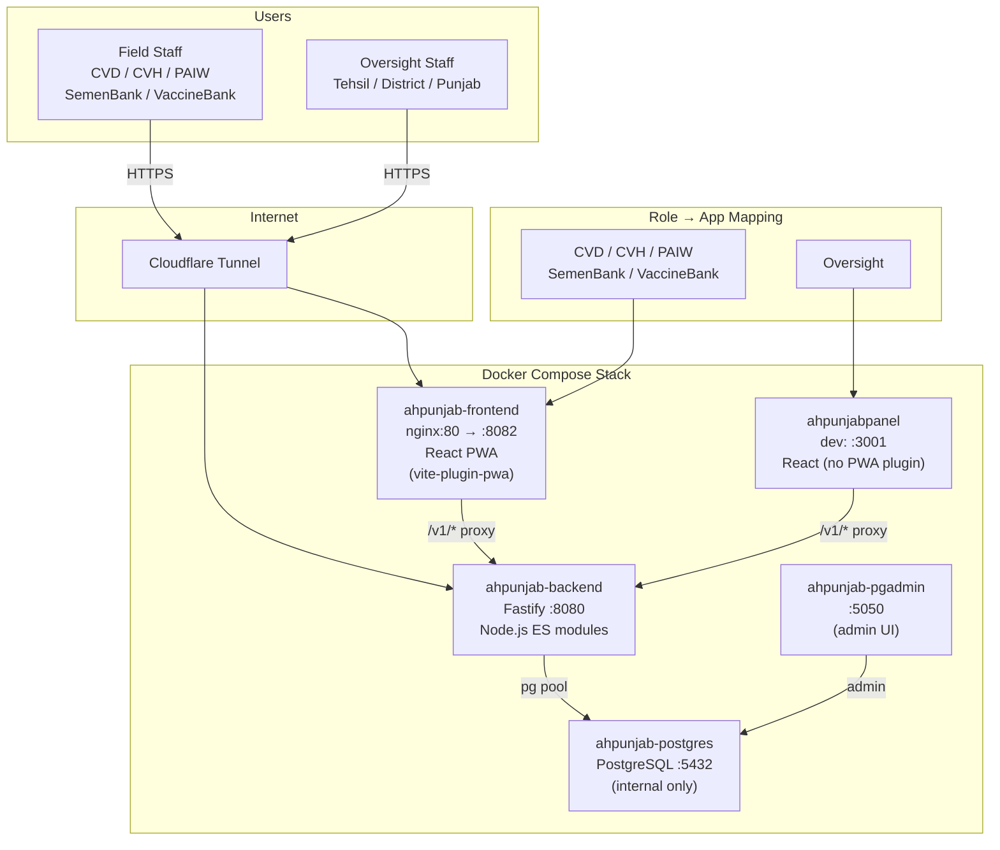

# System Architecture

**Two deployments, one backend.** The PWA serves field staff who submit monthly reports, issue/receive vaccines and semen. The panel serves oversight staff (Tehsil/District/Punjab) who approve report sections, compile frozen period reports, and manage master data. The backend enforces role separation: field routes reject Oversight (403), panel routes reject field roles (403).

Key files:
- `ahpunjabfrontend/src/config/roles.ts` — `FIELD_ROLES`, `isFieldRole()`
- `ahpunjabpanel/src/config/roles.ts` — `OVERSIGHT_ROLE`, `isOversightRole()`
- `Backend/src/config/roles.js` — server-side role constants
- `Backend/src/server.js` — route registration with prefixes
