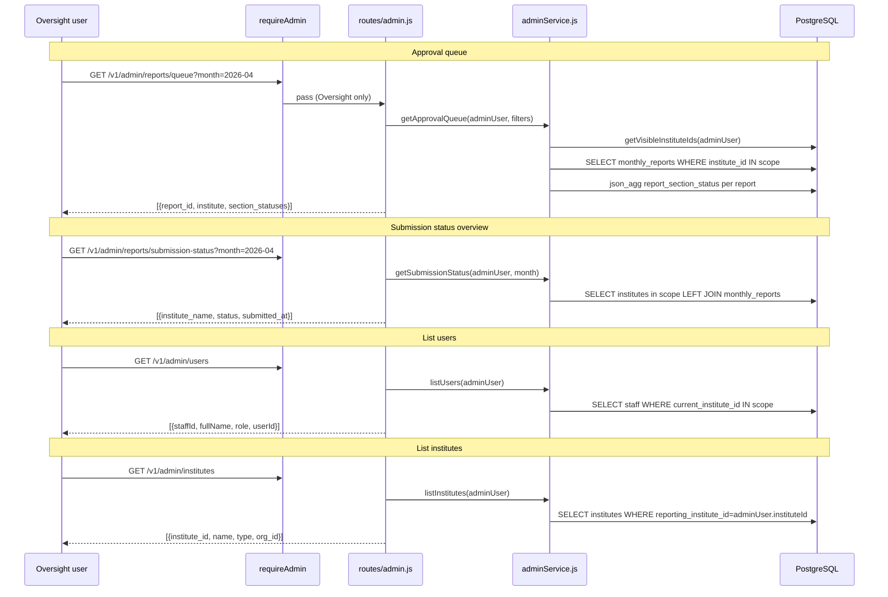

# Endpoints: Admin Routes

```mermaid
sequenceDiagram
    participant A as Oversight user
    participant M as requireAdmin
    participant R as routes/admin.js
    participant S as adminService.js
    participant DB as PostgreSQL

    Note over A,DB: Approval queue
    A->>M: GET /v1/admin/reports/queue?month=2026-04
    M->>R: pass (Oversight only)
    R->>S: getApprovalQueue(adminUser, filters)
    S->>DB: getVisibleInstituteIds(adminUser)
    S->>DB: SELECT monthly_reports WHERE institute_id IN scope
    S->>DB: json_agg report_section_status per report
    R-->>A: [{report_id, institute, section_statuses}]

    Note over A,DB: Submission status overview
    A->>M: GET /v1/admin/reports/submission-status?month=2026-04
    R->>S: getSubmissionStatus(adminUser, month)
    S->>DB: SELECT institutes in scope LEFT JOIN monthly_reports
    R-->>A: [{institute_name, status, submitted_at}]

    Note over A,DB: List users
    A->>M: GET /v1/admin/users
    R->>S: listUsers(adminUser)
    S->>DB: SELECT staff WHERE current_institute_id IN scope
    R-->>A: [{staffId, fullName, role, userId}]

    Note over A,DB: List institutes
    A->>M: GET /v1/admin/institutes
    R->>S: listInstitutes(adminUser)
    S->>DB: SELECT institutes WHERE reporting_institute_id=adminUser.instituteId
    R-->>A: [{institute_id, name, type, org_id}]
```

**Key files:** `Backend/src/routes/admin.js`, `Backend/src/services/adminService.js`, `Backend/src/utils/scope.js`
