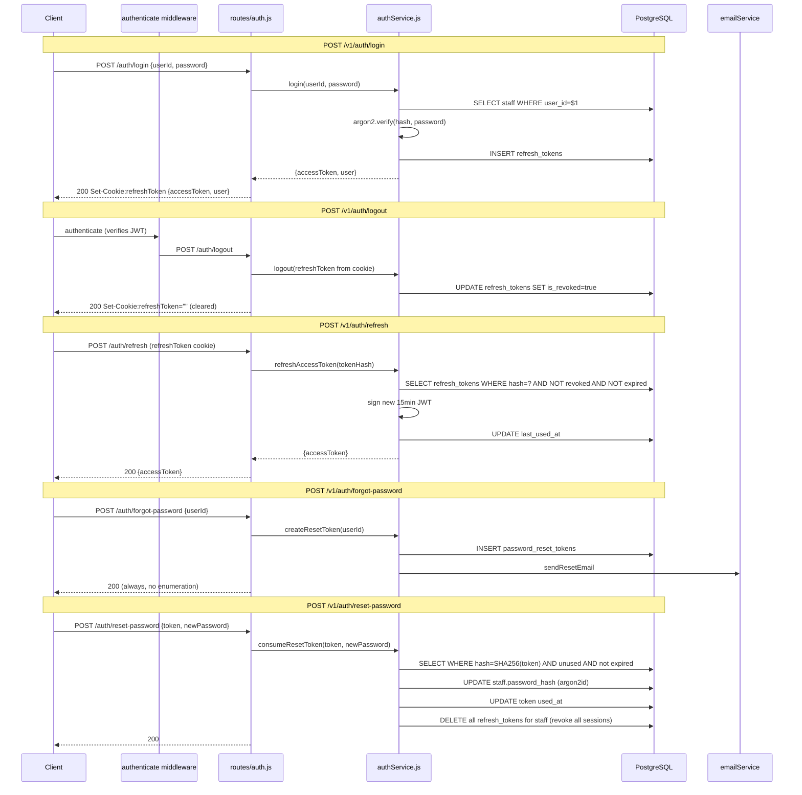

# Endpoints: Authentication

**Key files:** `Backend/src/routes/auth.js`, `Backend/src/services/authService.js`, `Backend/src/services/passwordResetService.js`, `Backend/src/services/refreshTokenService.js`
