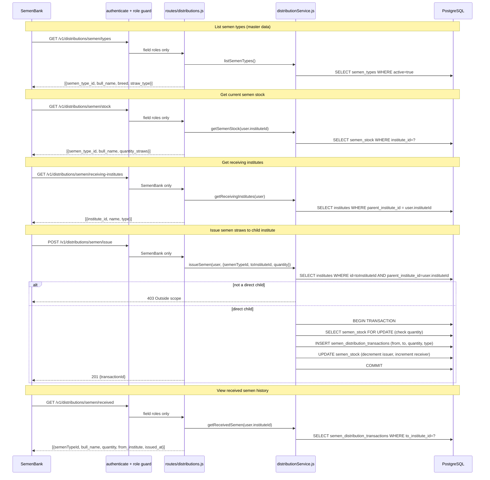

# Endpoints: Semen Distributions

**Key files:** `Backend/src/routes/distributions.js`, `Backend/src/services/distributionService.js`

`semen_distribution_transactions` mirrors the structure of `vaccine_transactions` for semen stock. Both use the same `parent_institute_id = user.instituteId` scope check — field staff can only issue to their direct children.
