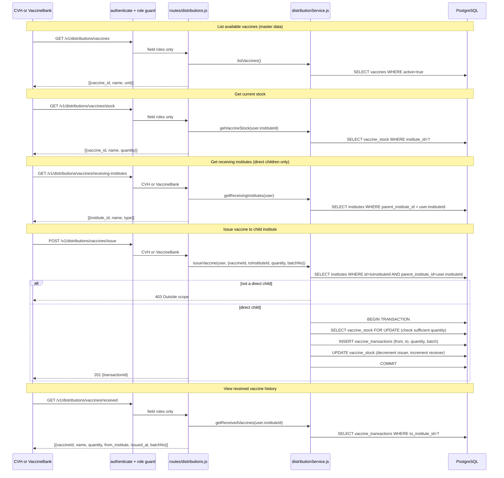

# Endpoints: Vaccine Distributions

**Key files:** `Backend/src/routes/distributions.js`, `Backend/src/services/distributionService.js`

Distribution scope uses `parent_institute_id` (stock-chain linkage) NOT `reporting_institute_id` (approval linkage). A CVH can only issue to institutes whose `parent_institute_id = CVH.instituteId`.
