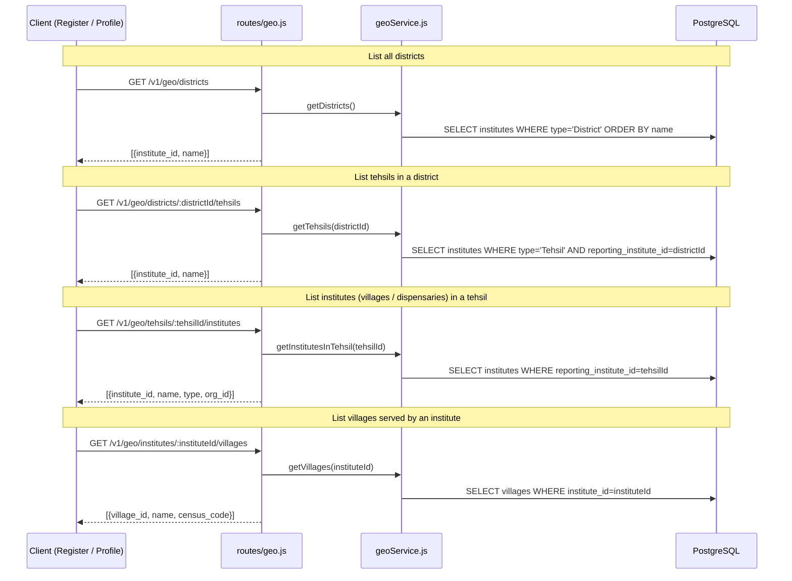

# Endpoints: Geography

**Key files:** `Backend/src/routes/geo.js`, `Backend/src/services/geoService.js`

Geo routes are public (no auth required) to allow the registration flow to populate dropdowns before the user has a session. The hierarchy is: Punjab → District → Tehsil → Village/Institute.
