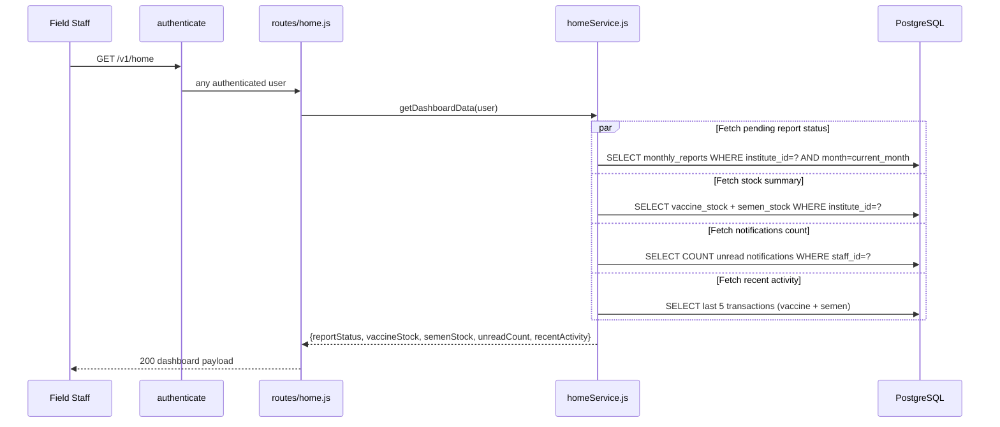

# Endpoints: Home / Dashboard

**Key files:** `Backend/src/routes/home.js`, `Backend/src/services/homeService.js`

The home endpoint aggregates across multiple tables in parallel queries to minimize latency. The `reportStatus` field tells the PWA whether to show a "submit pending" badge on the Monthly Reporting quick action.
