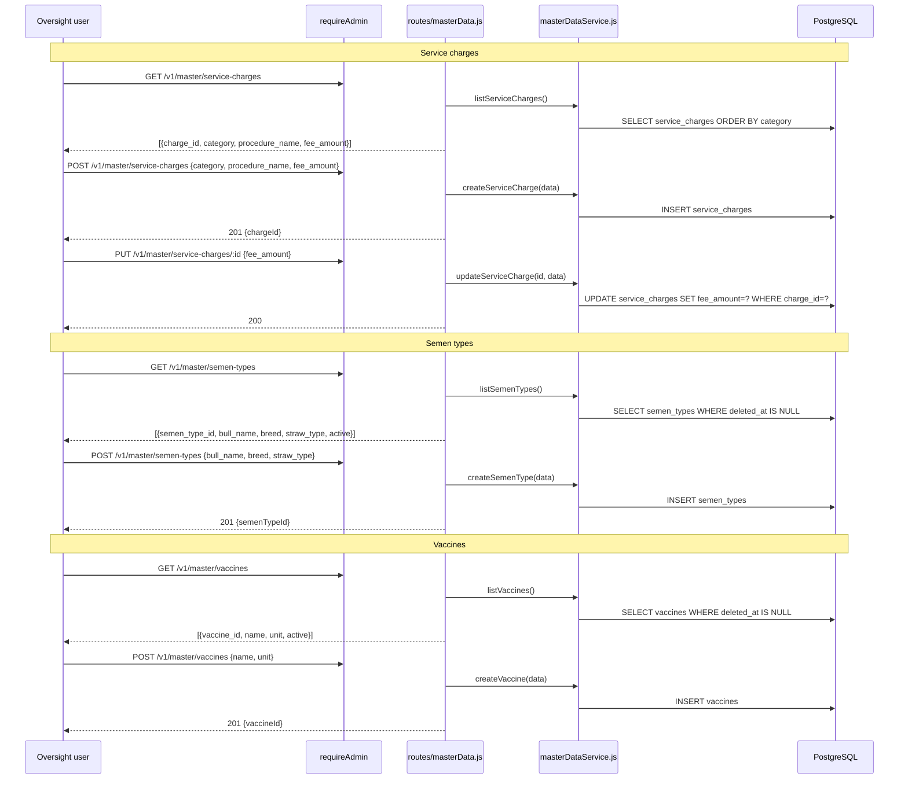

# Endpoints: Master Data

**Key files:** `Backend/src/routes/masterData.js`, `Backend/src/services/masterDataService.js`

Service charges feed the `get_fee_summary()` Postgres function used during the close-period compile step. The regression anchor (Talwandi Sabo Tehsil, April 2026 = ₹62,425) depends on these rates being unchanged.
