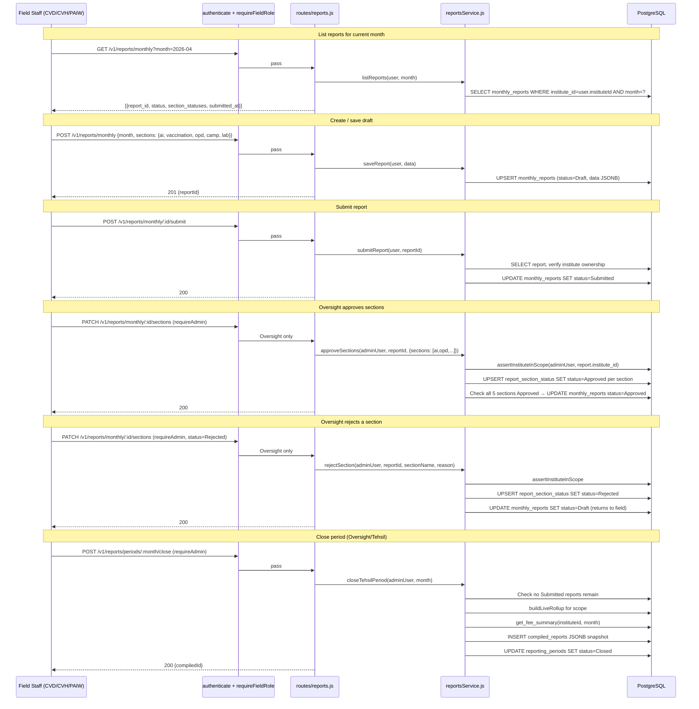

# Endpoints: Monthly Reports

**Key files:** `Backend/src/routes/reports.js`, `Backend/src/services/reportsService.js`, `Backend/src/utils/scope.js`, `Backend/src/services/rollupService.js`

**Critical distinction:** `approveSections` checks per-section status; only when ALL 5 sections (ai_report, vaccination_report, camp_report, opd_report, lab_report) are Approved does the parent `monthly_reports` row flip to Approved. A single `rejectSection` call immediately returns the report to Draft status, requiring the field staff to resubmit after correction.
