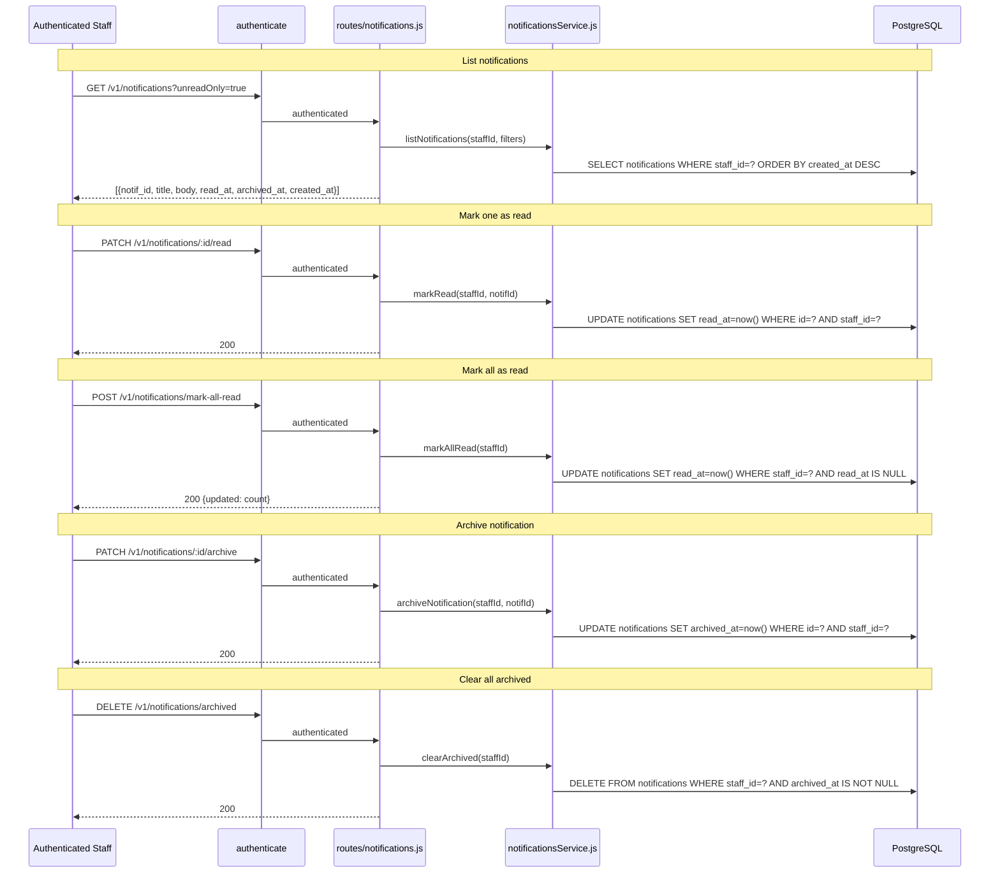

# Endpoints: Notifications

**Key files:** `Backend/src/routes/notifications.js`, `Backend/src/services/notificationsService.js`

Notifications are created server-side by events: report approval/rejection, period close, and distribution receipts. They are staff-scoped (each staff member has their own queue). PWA badge count comes from `GET /v1/home` unreadCount field, not a separate poll.
