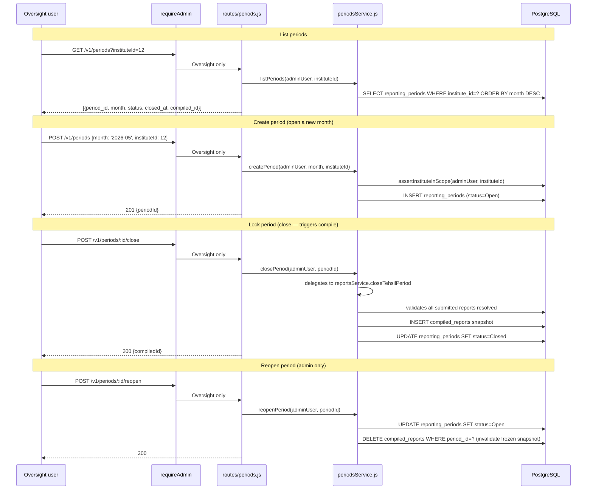

# Endpoints: Reporting Periods

**Key files:** `Backend/src/routes/periods.js`, `Backend/src/services/periodsService.js`, `Backend/src/services/reportsService.js`

Once a period is Closed, rollup reads from `compiled_reports` (frozen JSONB). Reopening deletes the snapshot and switches rollup back to live SUM mode.
