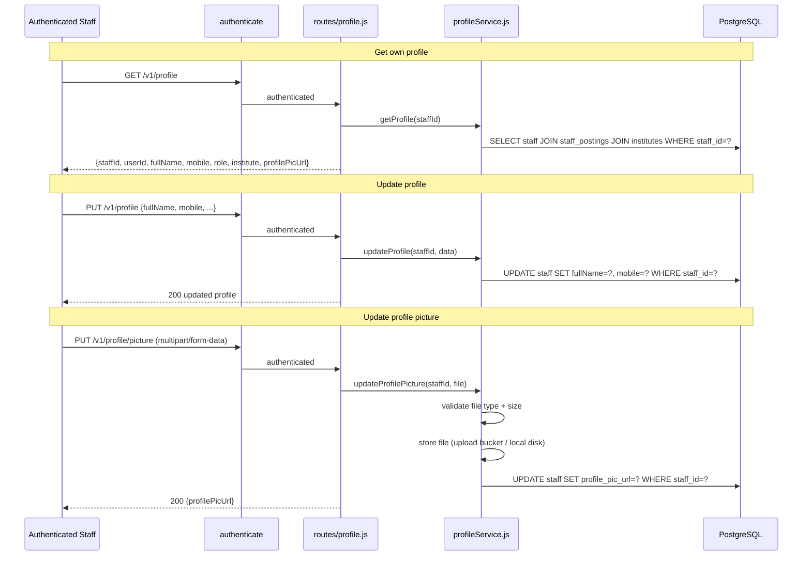

# Endpoints: Profile

```mermaid
sequenceDiagram
    participant U as Authenticated Staff
    participant M as authenticate
    participant R as routes/profile.js
    participant S as profileService.js
    participant DB as PostgreSQL

    Note over U,DB: Get own profile
    U->>M: GET /v1/profile
    M->>R: authenticated
    R->>S: getProfile(staffId)
    S->>DB: SELECT staff JOIN staff_postings JOIN institutes WHERE staff_id=?
    R-->>U: {staffId, userId, fullName, mobile, role, institute, profilePicUrl}

    Note over U,DB: Update profile
    U->>M: PUT /v1/profile {fullName, mobile, ...}
    M->>R: authenticated
    R->>S: updateProfile(staffId, data)
    S->>DB: UPDATE staff SET fullName=?, mobile=? WHERE staff_id=?
    R-->>U: 200 updated profile

    Note over U,DB: Update profile picture
    U->>M: PUT /v1/profile/picture (multipart/form-data)
    M->>R: authenticated
    R->>S: updateProfilePicture(staffId, file)
    S->>S: validate file type + size
    S->>S: store file (upload bucket / local disk)
    S->>DB: UPDATE staff SET profile_pic_url=? WHERE staff_id=?
    R-->>U: 200 {profilePicUrl}
```

**Key files:** `Backend/src/routes/profile.js`, `Backend/src/services/profileService.js`
