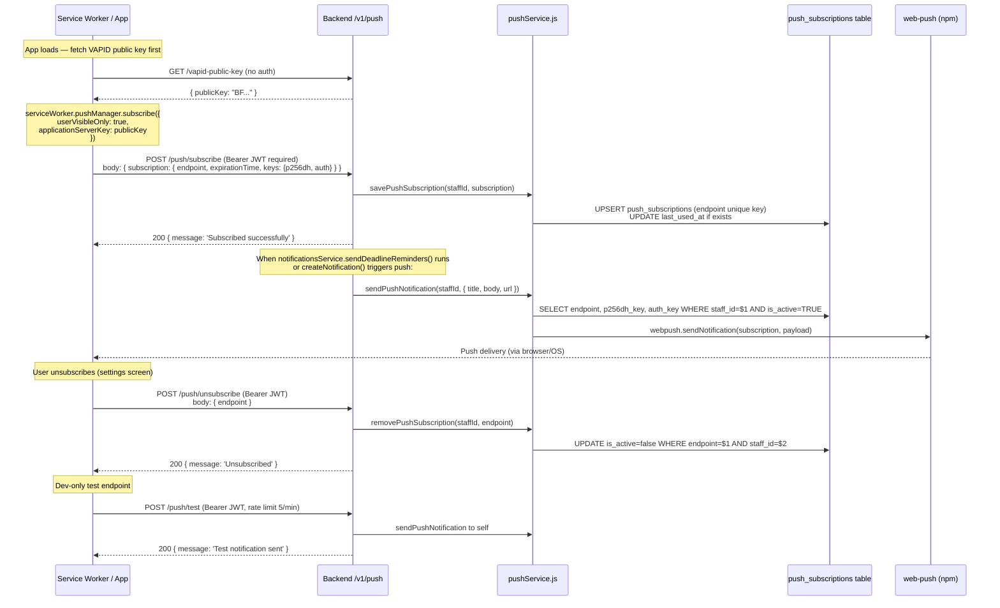

# Endpoints: /v1/push

Web Push subscription management using the Web Push Protocol (VAPID).

**Endpoints:**

| Method | Path | Auth | Rate limit |
|--------|------|------|------------|
| GET | `/v1/push/vapid-public-key` | None | Default |
| POST | `/v1/push/subscribe` | JWT | 10/min |
| POST | `/v1/push/unsubscribe` | JWT | 10/min |
| POST | `/v1/push/test` | JWT | 5/min |

**VAPID config** — set via env vars `VAPID_PUBLIC_KEY`, `VAPID_PRIVATE_KEY`, `VAPID_SUBJECT`. If keys are absent the service logs a warning and silently skips push delivery.
