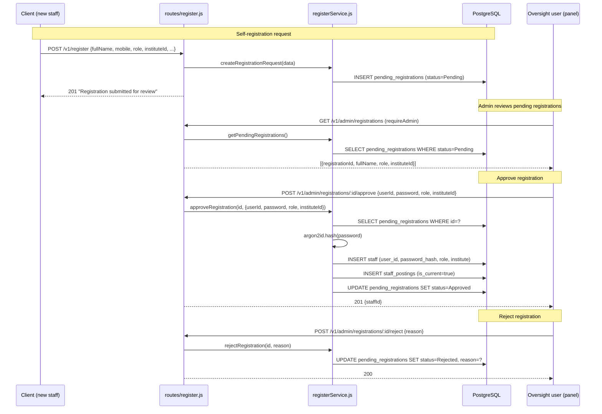

# Endpoints: Registration

```mermaid
sequenceDiagram
    participant C as Client (new staff)
    participant R as routes/register.js
    participant S as registerService.js
    participant DB as PostgreSQL
    participant Admin as Oversight user (panel)

    Note over C,DB: Self-registration request
    C->>R: POST /v1/register {fullName, mobile, role, instituteId, ...}
    R->>S: createRegistrationRequest(data)
    S->>DB: INSERT pending_registrations (status=Pending)
    R-->>C: 201 "Registration submitted for review"

    Note over Admin,DB: Admin reviews pending registrations
    Admin->>R: GET /v1/admin/registrations (requireAdmin)
    R->>S: getPendingRegistrations()
    S->>DB: SELECT pending_registrations WHERE status=Pending
    R-->>Admin: [{registrationId, fullName, role, instituteId}]

    Note over Admin,DB: Approve registration
    Admin->>R: POST /v1/admin/registrations/:id/approve {userId, password, role, instituteId}
    R->>S: approveRegistration(id, {userId, password, role, instituteId})
    S->>DB: SELECT pending_registrations WHERE id=?
    S->>S: argon2id.hash(password)
    S->>DB: INSERT staff (user_id, password_hash, role, institute)
    S->>DB: INSERT staff_postings (is_current=true)
    S->>DB: UPDATE pending_registrations SET status=Approved
    R-->>Admin: 201 {staffId}

    Note over Admin,DB: Reject registration
    Admin->>R: POST /v1/admin/registrations/:id/reject {reason}
    R->>S: rejectRegistration(id, reason)
    S->>DB: UPDATE pending_registrations SET status=Rejected, reason=?
    R-->>Admin: 200
```

**Key files:** `Backend/src/routes/register.js`, `Backend/src/services/registerService.js`
