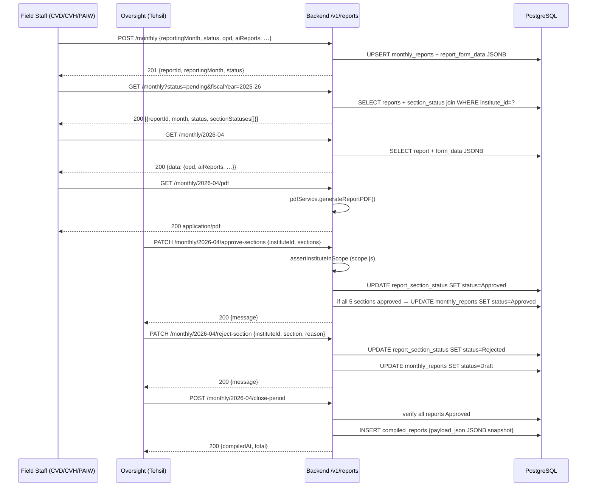

# Endpoints: Reports (`/v1/reports`)

Monthly report lifecycle — create/save draft, submit, section-level approve/reject, close period.

## Route → Guard matrix

| Method | Path | Guard |
|---|---|---|
| POST | /monthly | authenticate + requireFieldRole |
| GET | /monthly | authenticate |
| GET | /monthly/:month | authenticate |
| GET | /monthly/:month/pdf | authenticate |
| PATCH | /monthly/:month/approve-sections | authenticate + requireAdminRole |
| PATCH | /monthly/:month/reject-section | authenticate + requireAdminRole |
| POST | /monthly/:month/close-period | authenticate + requireAdminRole |

**Sections:** `ai_report`, `vaccination_report`, `camp_report`, `opd_report`, `lab_report`

**File:** `Backend/src/routes/reports.js`
