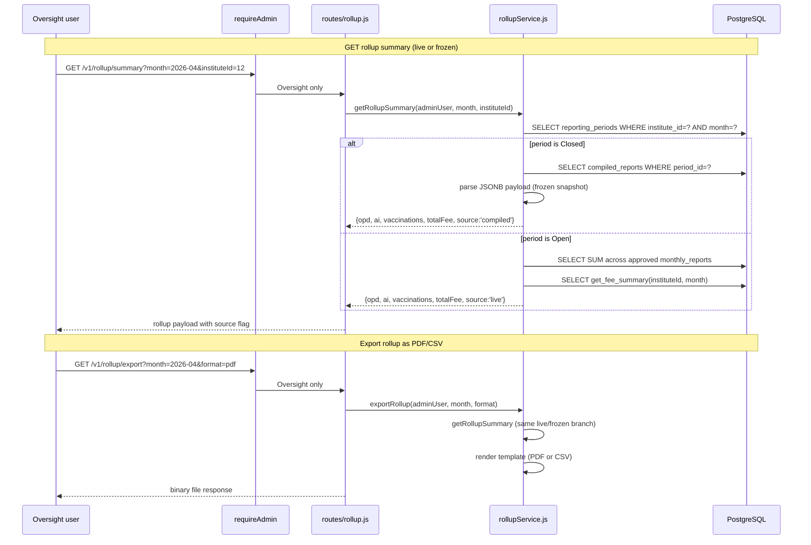

# Endpoints: Rollup / Consolidated Summary

**Key files:** `Backend/src/routes/rollup.js`, `Backend/src/services/rollupService.js`

**Inconsistency flagged:** The panel's `ConsolidatedDashboardScreen.tsx` reads keys `aiSummary`, `opdSummary`, `vaccinationSummary` — but `getRollupSummary` returns `ai`, `opd`, `vaccinations`. Also `total_doses`/`total_animals` vs actual `doses_used`/`animals_vaccinated`. These mismatches mean the panel dashboard renders empty/undefined data.
