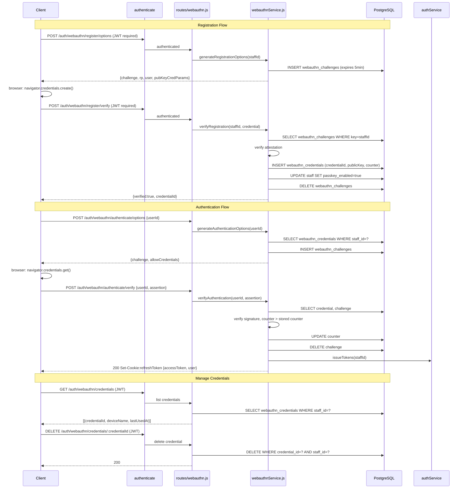

# Endpoints: WebAuthn / Passkeys

```mermaid
sequenceDiagram
    participant C as Client
    participant M as authenticate
    participant R as routes/webauthn.js
    participant S as webauthnService.js
    participant DB as PostgreSQL

    Note over C,DB: Registration Flow
    C->>M: POST /auth/webauthn/register/options (JWT required)
    M->>R: authenticated
    R->>S: generateRegistrationOptions(staffId)
    S->>DB: INSERT webauthn_challenges (expires 5min)
    S-->>C: {challenge, rp, user, pubKeyCredParams}

    C->>C: browser: navigator.credentials.create()
    C->>M: POST /auth/webauthn/register/verify (JWT required)
    M->>R: authenticated
    R->>S: verifyRegistration(staffId, credential)
    S->>DB: SELECT webauthn_challenges WHERE key=staffId
    S->>S: verify attestation
    S->>DB: INSERT webauthn_credentials (credentialId, publicKey, counter)
    S->>DB: UPDATE staff SET passkey_enabled=true
    S->>DB: DELETE webauthn_challenges
    S-->>C: {verified:true, credentialId}

    Note over C,DB: Authentication Flow
    C->>R: POST /auth/webauthn/authenticate/options {userId}
    R->>S: generateAuthenticationOptions(userId)
    S->>DB: SELECT webauthn_credentials WHERE staff_id=?
    S->>DB: INSERT webauthn_challenges
    S-->>C: {challenge, allowCredentials}

    C->>C: browser: navigator.credentials.get()
    C->>R: POST /auth/webauthn/authenticate/verify {userId, assertion}
    R->>S: verifyAuthentication(userId, assertion)
    S->>DB: SELECT credential, challenge
    S->>S: verify signature, counter > stored counter
    S->>DB: UPDATE counter
    S->>DB: DELETE challenge
    S->>authService: issueTokens(staffId)
    S-->>C: 200 Set-Cookie:refreshToken {accessToken, user}

    Note over C,DB: Manage Credentials
    C->>M: GET /auth/webauthn/credentials (JWT)
    M->>R: list credentials
    R->>DB: SELECT webauthn_credentials WHERE staff_id=?
    R-->>C: [{credentialId, deviceName, lastUsedAt}]

    C->>M: DELETE /auth/webauthn/credentials/:credentialId (JWT)
    M->>R: delete credential
    R->>DB: DELETE WHERE credential_id=? AND staff_id=?
    R-->>C: 200
```

**Key files:** `Backend/src/routes/webauthn.js`, `Backend/src/services/webauthnService.js`
