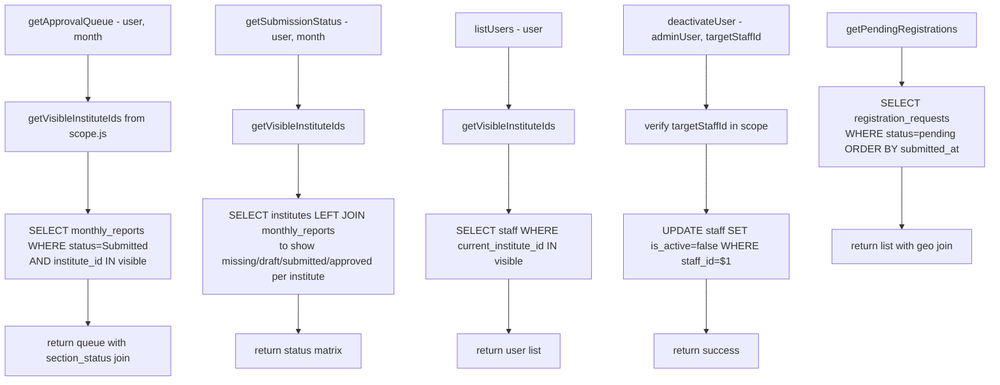

# File: Backend/src/services/adminService.js

Oversight-facing operations: approval queue, submission status, user management.

**Exports:** `getApprovalQueue`, `getSubmissionStatus`, `listUsers`, `deactivateUser`, `getPendingRegistrations`

**Called by:** `controllers/adminController.js`

**File:** `Backend/src/services/adminService.js`
