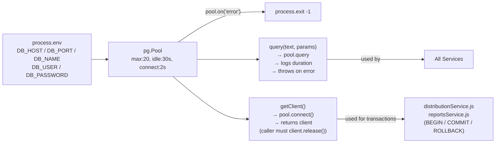

# File: Backend/src/database/db.js

**Key files:** `Backend/src/database/db.js`

`query()` is for single-statement calls; `getClient()` returns a raw pg client for multi-statement transactions where the caller manually calls `BEGIN`, `COMMIT`, `ROLLBACK`, and `client.release()`. Pool size is capped at 20 connections. If DB_PASSWORD is missing in production the process crashes immediately on boot rather than silently connecting with a default.
