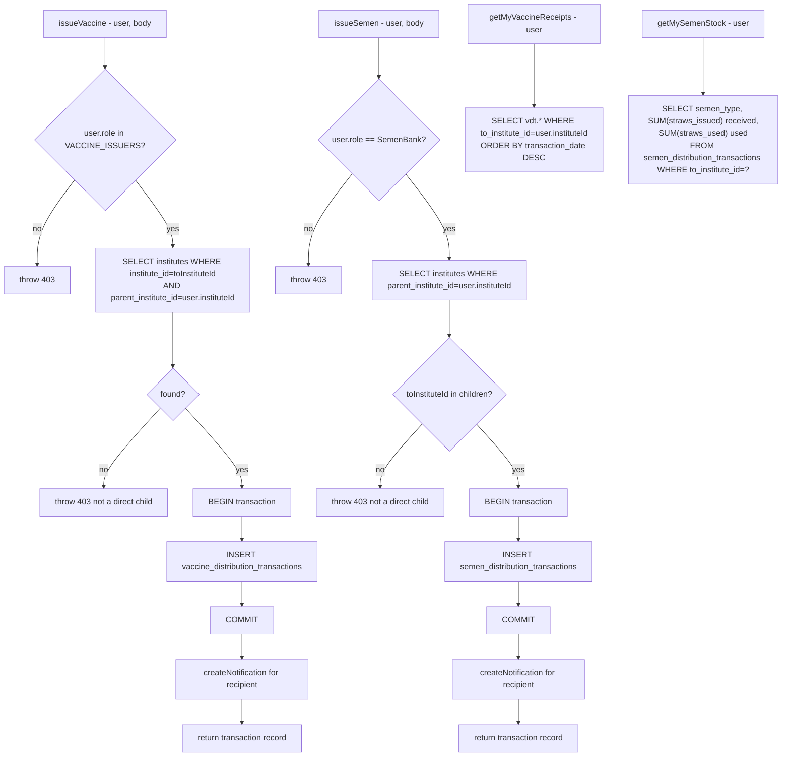

# File: Backend/src/services/distributionService.js

Vaccine and semen issuance — direct-child-only scoping via `parent_institute_id`.

**Key invariant:** `parent_institute_id` (NOT `reporting_institute_id`) is used for direct-child check. This ensures distribution only flows one hop down the hierarchy.

**File:** `Backend/src/services/distributionService.js`
