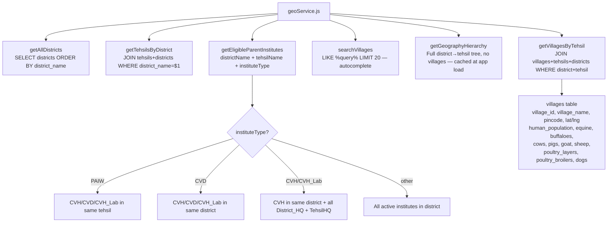

# File: Backend/src/services/geoService.js

Read-only geographic hierarchy queries: districts → tehsils → villages with livestock population data. Also resolves eligible parent institutes during registration.

**Notes:**
- `getVillagesByTehsil` returns `null` (not 404) when the district/tehsil combo doesn't exist — the route controller translates this to a 404 response.
- Village population fields (equine, buffaloes, etc.) are the basis for AI coverage % on dashboards.
- `getGeographyHierarchy` returns a grouped object keyed by district name — used by RegisterScreen to populate district/tehsil dropdowns without paginating the API.
- `getEligibleParentInstitutes` sorts results by institute type priority so CVH appears before CVD in dropdown lists.
