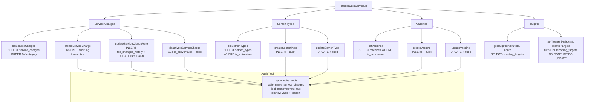

# File: Backend/src/services/masterDataService.js

Admin-only CRUD for the reference tables that drive report calculations: service charges, semen types, vaccines, and per-institute reporting targets.

**Key patterns:**
- All write operations run inside a `getClient()` transaction with `BEGIN / COMMIT / ROLLBACK`.
- `audit()` helper inserts into `report_edits_audit` with `report_id=0` (sentinel for non-report audit rows).
- `createServiceCharge` catches `pg error 23505` (unique constraint on `service_code`) and rethrows as HTTP 409.
- Targets use `ON CONFLICT (institute_id, month) DO UPDATE` — idempotent upsert, no history needed.
- Scope enforcement: callers (route preHandlers) verify admin role before these functions are called; functions themselves trust the caller.
