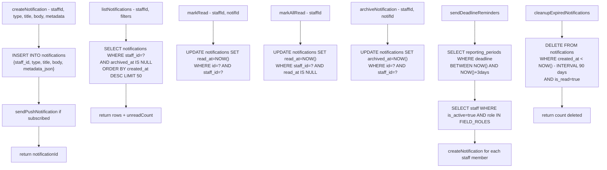

# File: Backend/src/services/notificationsService.js

In-app notification creation, delivery, and cleanup.

**Called by:** `distributionService.js` (receipt notifications), `reportsService.js` (approval/rejection), `server.js` (startup cleanup + deadline reminders)

**File:** `Backend/src/services/notificationsService.js`
