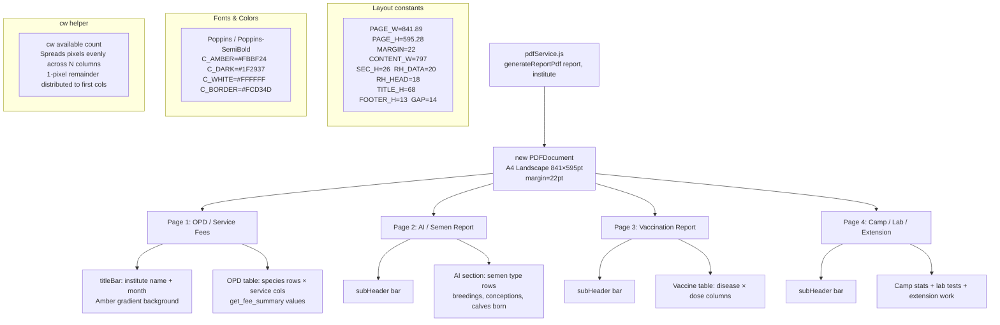

# File: Backend/src/services/pdfService.js

Generates AH Punjab branded A4 landscape monthly report PDFs using PDFKit. The layout mirrors the official government report template with an amber/yellow brand palette.

**Key implementation details:**
- Font files loaded from `Backend/fonts/` directory (Poppins TTF).
- Assets (logo, etc.) loaded from `Backend/assets/`.
- `cw(available, count)` distributes integer column widths without fractional pixels to avoid blurry lines.
- Each page section is drawn with explicit x/y coordinates; the service uses a cursor-style `y` variable that advances after each row.
- Called by `reportsService.generatePdf(reportId)` which fetches the report data then passes it to this service.
