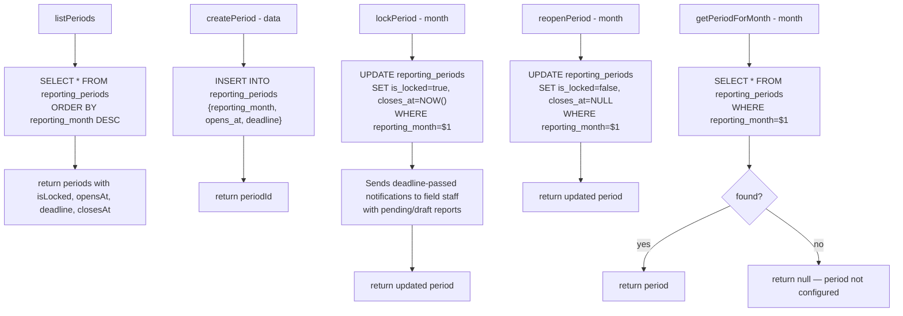

# File: Backend/src/services/periodsService.js

Reporting period lifecycle — create, lock, reopen.

**Effect of locking:** Field staff can no longer save or submit reports for that month. `POST /reports/monthly` checks `is_locked` and returns 403 if true.

**Called by:** `periodsController.js`, `reportsService.js` (lock check)

**File:** `Backend/src/services/periodsService.js`
