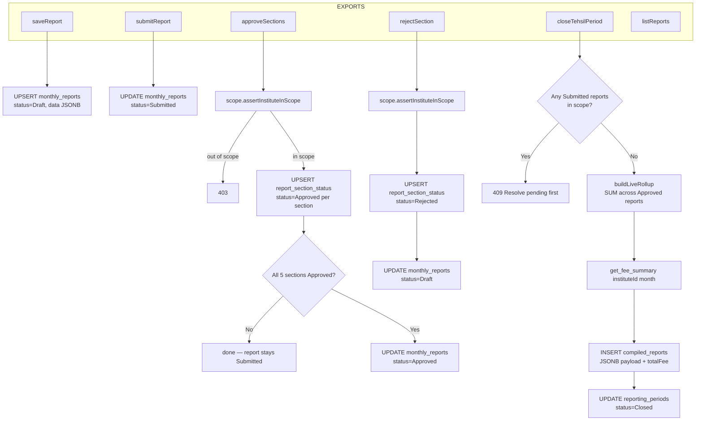

# File: Backend/src/services/reportsService.js

**Key files:** `Backend/src/services/reportsService.js`, `Backend/src/utils/scope.js`, `Backend/src/services/rollupService.js`

Per-section status lives in `report_section_status` (one row per report×section). The parent `monthly_reports.status` is derived: all 5 approved → Approved; any rejected → returns to Draft. The `closeTehsilPeriod` compile step is the critical path — once the period is Closed the frozen `compiled_reports` JSONB snapshot becomes the authoritative source for rollup reads at higher tiers.
