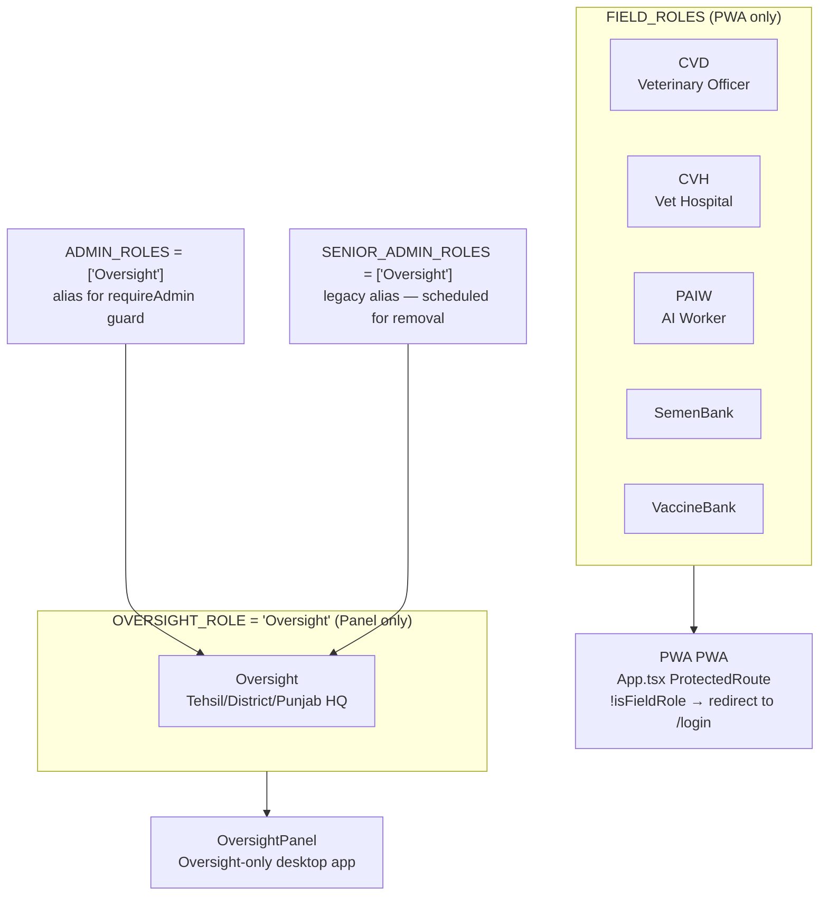

# File: Backend/src/config/roles.js

**Key files:** `Backend/src/config/roles.js`, `PWA/src/config/roles.ts`

`OVERSIGHT_ROLE` holds the actual string `'Oversight'` (the agreed placeholder). `ADMIN_ROLES` and `SENIOR_ADMIN_ROLES` are legacy aliases kept during the PWA/panel split — they will be removed once the panel takes over admin routes. Field staff who log in on the PWA will be redirected to `/login` if their role is not in `FIELD_ROLES`.
