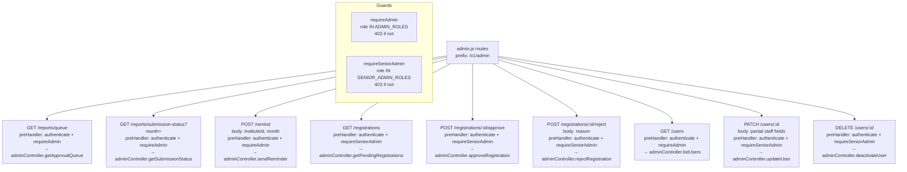

# File: Backend/src/routes/admin.js

Admin route definitions. Mounted at `/v1/admin`. Two access tiers: Tehsil_Admin and above (`requireAdmin`) for approval queue and submission status; Senior Admin only (`requireSeniorAdmin` = HQ_Admin / Super_Admin) for registration lifecycle and user management.

**Role constants** (`src/config/roles.js`):
- `ADMIN_ROLES` — Tehsil_Admin, District_Admin, HQ_Admin, Super_Admin
- `SENIOR_ADMIN_ROLES` — HQ_Admin, Super_Admin

All routes also pass through the global `authenticate` middleware which validates the JWT and attaches `request.user`.
