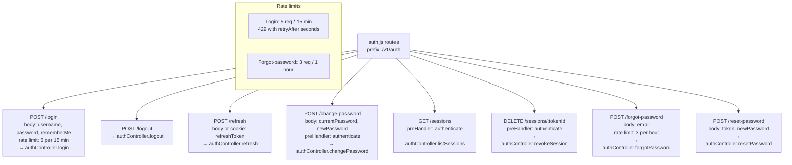

# File: Backend/src/routes/auth.js

Authentication route definitions. Mounted at `/v1/auth`. Handles login, logout, token refresh, password change, active sessions, and password reset flow.

**Notes:**
- Login rate limit uses a custom `errorResponseBuilder` that includes `retryAfter` in seconds for the PWA to display a countdown.
- `POST /refresh` reads the token from `request.cookies.refreshToken` (HttpOnly cookie) or `request.body.refreshToken`; cookie is preferred.
- `GET /sessions` returns all active (non-revoked, non-expired) refresh tokens for the current user with `deviceName` and `lastUsedAt` so the user can revoke individual sessions from the UI.
- `POST /forgot-password` always returns 200 regardless of whether the email exists (anti-enumeration).
