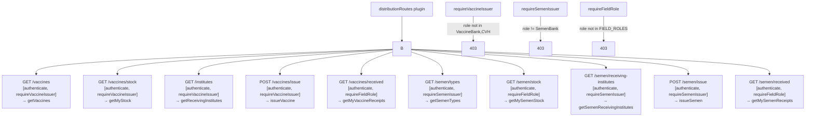

# File: Backend/src/routes/distributions.js

Distribution route definitions — separate role guards for vaccine issuers vs semen issuers vs field receivers.

**Registered at:** `server.js` → `fastify.register(routes/distributions.js, {prefix: /v1/admin/distributions})`

**File:** `Backend/src/routes/distributions.js`
