# File: Backend/src/routes/masterData.js

Reference data CRUD. Mounted at `/v1/admin/master-data`. All routes require Senior Admin role.

```mermaid
flowchart TD
    A[masterData.js routes\nprefix: /v1/admin/master-data] --> B[Service Charges]
    A --> C[Semen Types]
    A --> D[Vaccines]
    A --> E[Targets]

    B --> B1[GET /charges\npreHandler: authenticate+requireAdmin\n→ masterDataController.listCharges]
    B --> B2[POST /charges\nbody: serviceCode, serviceName, category, currentRate, effectiveFrom\npreHandler: authenticate+requireSeniorAdmin\n→ masterDataController.createCharge]
    B --> B3[PATCH /charges/:id/rate\nbody: newRate, effectiveMonth\npreHandler: authenticate+requireSeniorAdmin\n→ masterDataController.updateChargeRate]
    B --> B4[DELETE /charges/:id\npreHandler: authenticate+requireSeniorAdmin\n→ masterDataController.deactivateCharge]

    C --> C1[GET /semen-types → listSemenTypes]
    C --> C2[POST /semen-types → createSemenType]
    C --> C3[PATCH /semen-types/:id → updateSemenType]

    D --> D1[GET /vaccines → listVaccines]
    D --> D2[POST /vaccines → createVaccine]
    D --> D3[PATCH /vaccines/:id → updateVaccine]

    E --> E1[GET /targets?instituteId=&month=\npreHandler: authenticate+requireAdmin\n→ masterDataController.getTargets]
    E --> E2[PUT /targets\nbody: instituteId, month, opd, ai\npreHandler: authenticate+requireSeniorAdmin\n→ masterDataController.setTargets\nUPSERT reporting_targets]
```

**Notes:**
- GET endpoints for charges/semen/vaccines use `requireAdmin` (Tehsil_Admin+); mutations require `requireSeniorAdmin` (HQ_Admin+).
- Rate updates write to `fee_changes_history` for an audit trail; the `service_charges.current_rate` is updated immediately.
- Deactivating a charge/vaccine/semen-type sets `is_active=false` — existing report data referencing these records is not affected.
