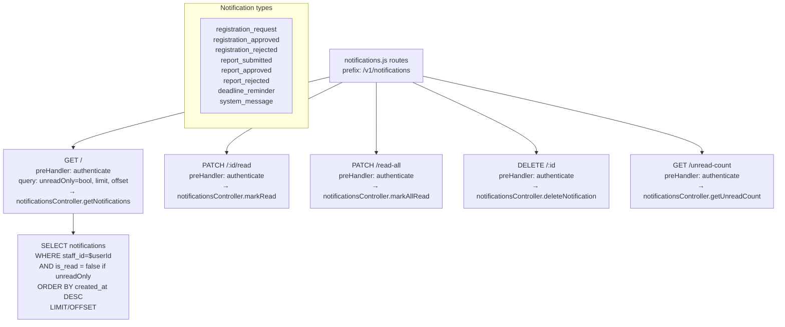

# File: Backend/src/routes/notifications.js

In-app notification inbox management. Mounted at `/v1/notifications`. All routes require authentication.

**Notes:**
- `GET /unread-count` is polled periodically by the PWA to update the notification badge in the nav bar.
- Notifications are created by other services (not directly via this API): `notificationsService.createNotification(staffId, type, title, body, metadata)`.
- `cleanupExpired()` is called at server startup and every 24 hours to delete notifications older than 90 days.
- All `PATCH` and `DELETE` operations include an ownership check: `WHERE notification_id=$1 AND staff_id=$userId` prevents users from modifying other users' notifications.
