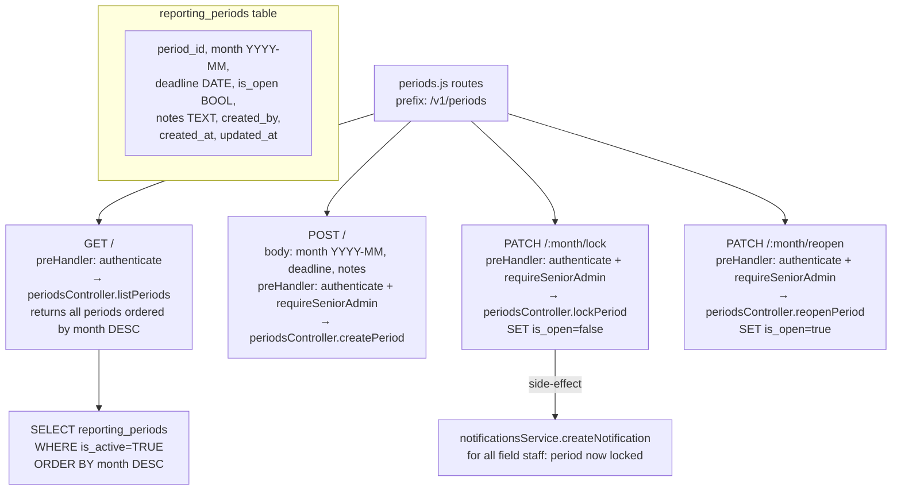

# File: Backend/src/routes/periods.js

Reporting period lifecycle management. Mounted at `/v1/periods`. HQ controls which months are open for submission.

**Business rules:**
- Only one period per month (`month` is a unique key). `createPeriod` returns 409 if the month already exists.
- Field staff can only submit reports when `is_open = TRUE` for that month; the reports route checks this before allowing `POST /reports/monthly`.
- Reopening a period after lock allows late submissions (used for error corrections approved by HQ).
- `lockPeriod` triggers a notification to all affected field staff.
