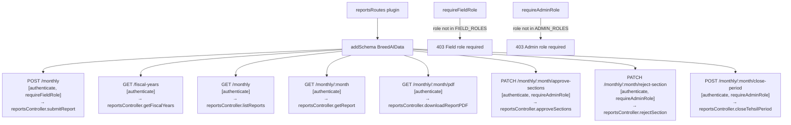

# File: Backend/src/routes/reports.js

Report route definitions with inline role guards.

**Registered at:** `server.js` → `fastify.register(routes/reports.js, {prefix: /v1/reports})`

**FIELD_ROLES:** CVD, CVH, PAIW, SemenBank, VaccineBank

**ADMIN_ROLES:** Oversight

**File:** `Backend/src/routes/reports.js`
