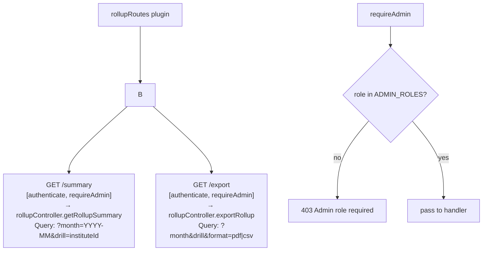
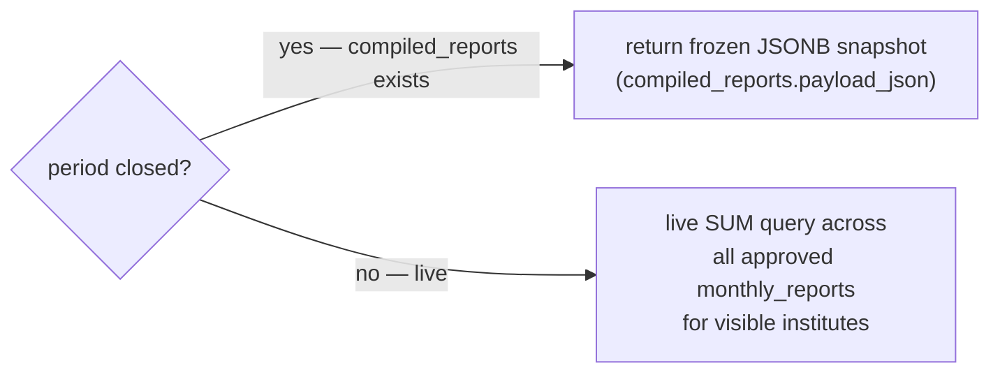

# File: Backend/src/routes/rollup.js

Rollup route definitions — Oversight only.

**GET /summary response:**

**Registered at:** `server.js` → `fastify.register(routes/rollup.js, {prefix: /v1/rollup})`

**File:** `Backend/src/routes/rollup.js`
