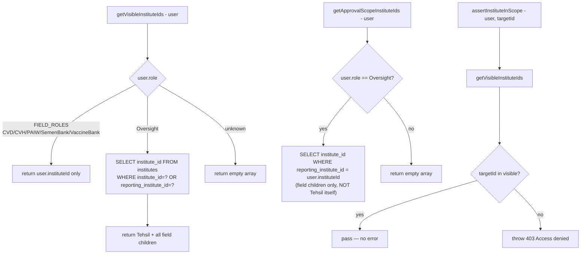

# File: Backend/src/utils/scope.js

The single chokepoint for data-isolation. All authorization guards call this.

**Exports:** `getVisibleInstituteIds`, `getApprovalScopeInstituteIds`, `assertInstituteInScope`

**Called by:** `adminService.js` (approval queue, submission status), `reportsService.js` (approveSections, rejectSection), `rollupService.js` (getRollupSummary), `distributionService.js` (issueVaccine, issueSemen)

**Critical distinction:** `reporting_institute_id` is used here for Oversight scope (which field institutes roll up to this Tehsil). `parent_institute_id` is NEVER used in scope.js — it belongs to distribution logic only.

**File:** `Backend/src/utils/scope.js`
