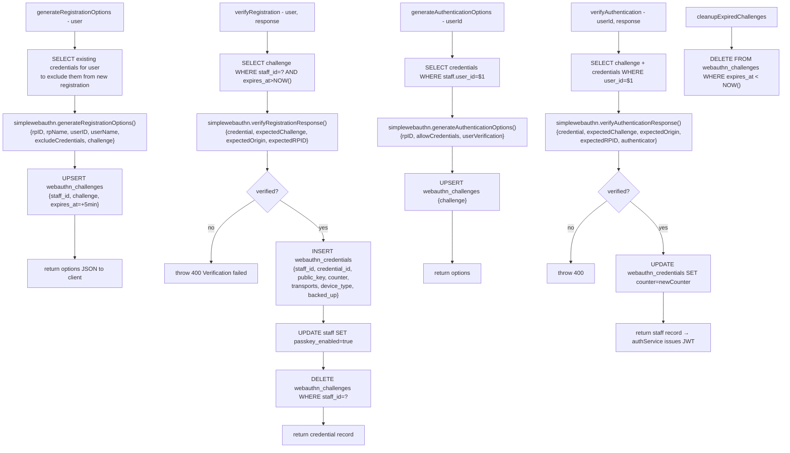

# File: Backend/src/services/webauthnService.js

WebAuthn passkey registration and authentication using `@simplewebauthn/server`.

```mermaid
flowchart TD
    A[generateRegistrationOptions - user] --> B["SELECT existing credentials for user
to exclude them from new registration"]
    B --> C["simplewebauthn.generateRegistrationOptions()
{rpID, rpName, userID, userName,
excludeCredentials, challenge}"]
    C --> D["UPSERT webauthn_challenges
{staff_id, challenge, expires_at=+5min}"]
    D --> E[return options JSON to client]

    F[verifyRegistration - user, response] --> G["SELECT challenge WHERE staff_id=? AND expires_at>NOW()"]
    G --> H["simplewebauthn.verifyRegistrationResponse()
{credential, expectedChallenge, expectedOrigin, expectedRPID}"]
    H --> I{verified?}
    I -->|no| J[throw 400 Verification failed]
    I -->|yes| K["INSERT webauthn_credentials
{staff_id, credential_id, public_key, counter,
transports, device_type, backed_up}"]
    K --> L["UPDATE staff SET passkey_enabled=true"]
    L --> M["DELETE webauthn_challenges WHERE staff_id=?"]
    M --> N[return credential record]

    O[generateAuthenticationOptions - userId] --> P["SELECT credentials WHERE staff.user_id=$1"]
    P --> Q["simplewebauthn.generateAuthenticationOptions()
{rpID, allowCredentials, userVerification}"]
    Q --> R["UPSERT webauthn_challenges {challenge}"]
    R --> S[return options]

    T[verifyAuthentication - userId, response] --> U["SELECT challenge + credentials WHERE user_id=$1"]
    U --> V["simplewebauthn.verifyAuthenticationResponse()
{credential, expectedChallenge, expectedOrigin,
expectedRPID, authenticator}"]
    V --> W{verified?}
    W -->|no| X[throw 400]
    W -->|yes| Y["UPDATE webauthn_credentials SET counter=newCounter"]
    Y --> Z[return staff record → authService issues JWT]

    AA[cleanupExpiredChallenges] --> BB["DELETE FROM webauthn_challenges WHERE expires_at < NOW()"]
```

**File:** `Backend/src/services/webauthnService.js`
