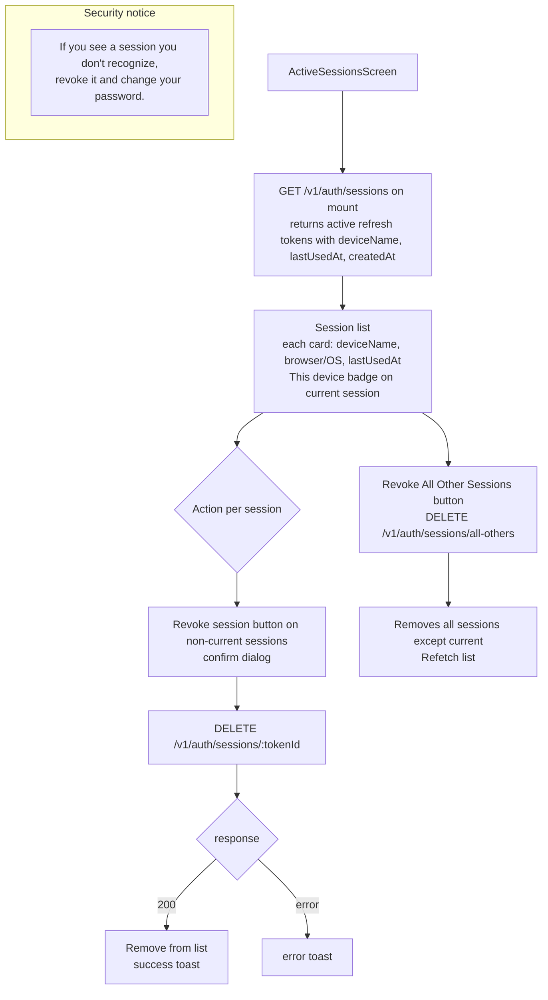

# File: PWA/src/screens/ActiveSessionsScreen.tsx

Shows all active login sessions (refresh tokens) across devices and allows revoking individual sessions.

**Notes:**
- The current session is identified by matching the current JWT's `jti` (token ID) against the session list.
- "Revoke All Other Sessions" is a one-click security measure for account compromise scenarios.
- `deviceName` is parsed from the User-Agent at login time by `refreshTokenService.parseDeviceName()`.
- This screen is linked from ProfileScreen under Security settings.
