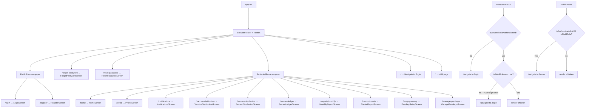

# File: ahpunjabfrontend/src/App.tsx

Root router with role-gating guards — blocks Oversight from PWA.

**Key behaviors:**
- `isFieldRole` comes from `src/config/roles.ts` — blocks Oversight users from logging into PWA
- `useEffect` on mount calls `initializePushNotifications()` when already logged in
- `AllScreensScreen` is lazy-loaded, dev-only

**File:** `ahpunjabfrontend/src/App.tsx`
