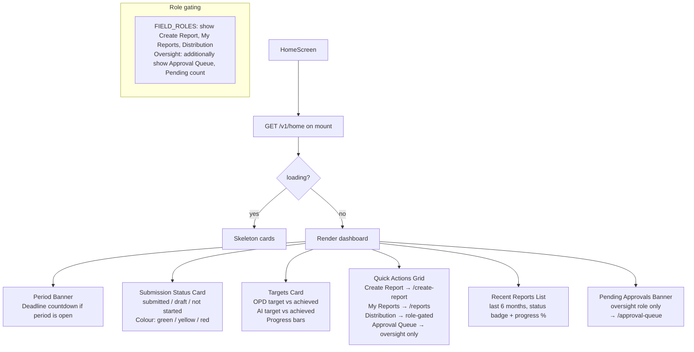

# File: PWA/src/screens/HomeScreen.tsx

Main dashboard. First screen after login. Shows submission status, targets, recent reports, and quick-action cards.

**Notes:**
- Single API call `GET /v1/home` provides all data; no waterfall of separate calls.
- Period banner is hidden if no open period exists.
- Quick action cards are filtered by role; PAIWs only see Create Report (AI section) and My Reports.
