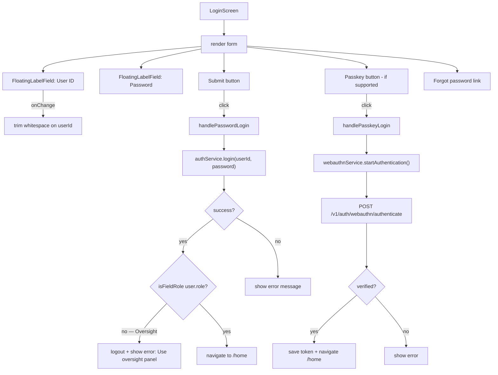

# File: ahpunjabfrontend/src/screens/LoginScreen.tsx

Password + passkey login with Oversight block.

**Oversight block:** Even if an Oversight user's credentials are valid, they are logged out immediately and shown "Please use the oversight panel." This prevents privilege confusion.

**File:** `ahpunjabfrontend/src/screens/LoginScreen.tsx`
