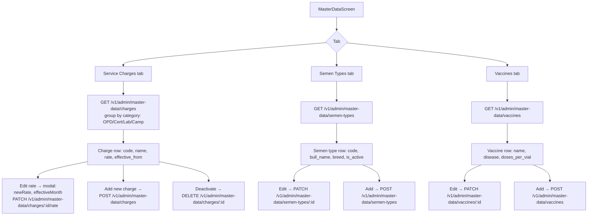

# File: ahpunjabfrontend/src/screens/MasterDataScreen.tsx

HQ Admin screen to manage the reference tables that power report calculations: service charges, semen types, and vaccines.

**Notes:**
- Deactivating a service charge hides it from new reports but does not affect historical calculations.
- Rate change history is stored in `fee_changes_history` for audit; only the current rate is shown here.
- Changes to semen types and vaccines propagate immediately to the distribution screens.
