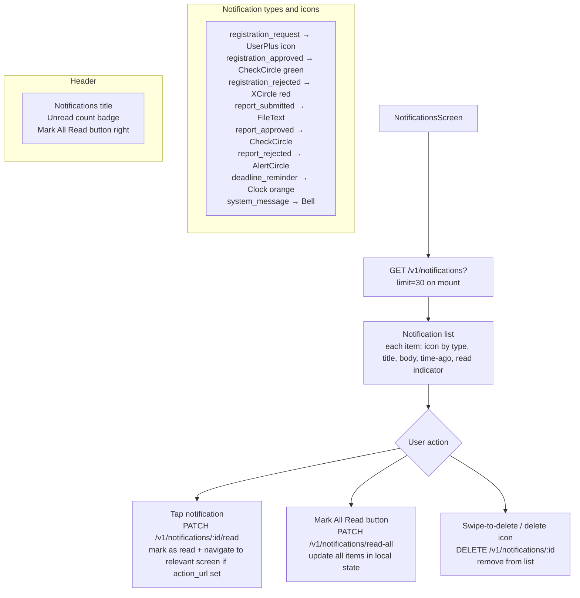

# File: PWA/src/screens/NotificationsScreen.tsx

In-app notification inbox. Supports mark read, mark all read, and delete.

**Notes:**
- Unread notifications have a yellow left border accent.
- `action_url` field on a notification (e.g., `/reports/2025-06`) causes tap to navigate there after marking read.
- The unread count badge in the app nav bar polls `GET /v1/notifications/unread-count` every 60 seconds.
