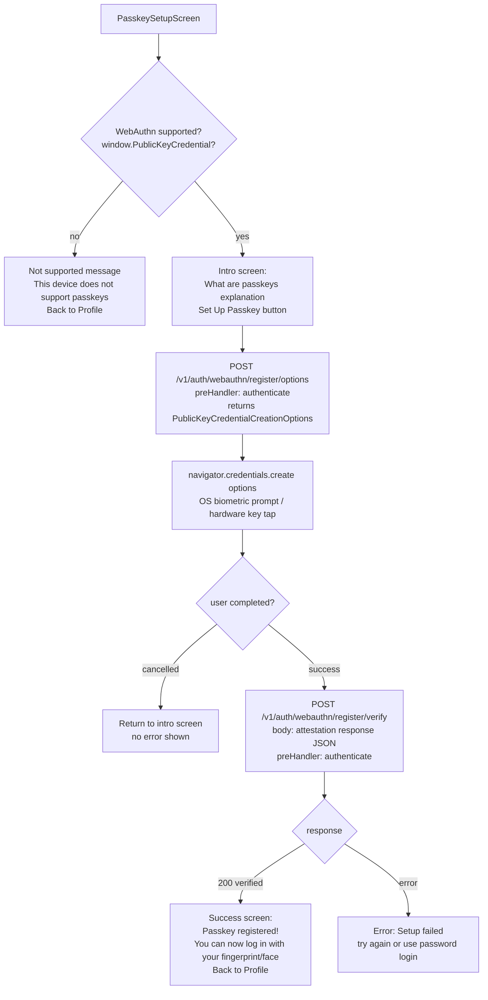

# File: ahpunjabfrontend/src/screens/PasskeySetupScreen.tsx

Guides the user through registering a new WebAuthn passkey (biometric or hardware key).

**Notes:**
- `navigator.credentials.create` triggers the platform authenticator (Touch ID, Face ID, Windows Hello, hardware key).
- The attestation response is serialized to JSON using `JSON.stringify` with ArrayBuffer → Base64url conversion before sending to the server.
- `relyingPartyId` is set to the domain (e.g., `ahdp.in`) so passkeys are scoped to the production domain only.
