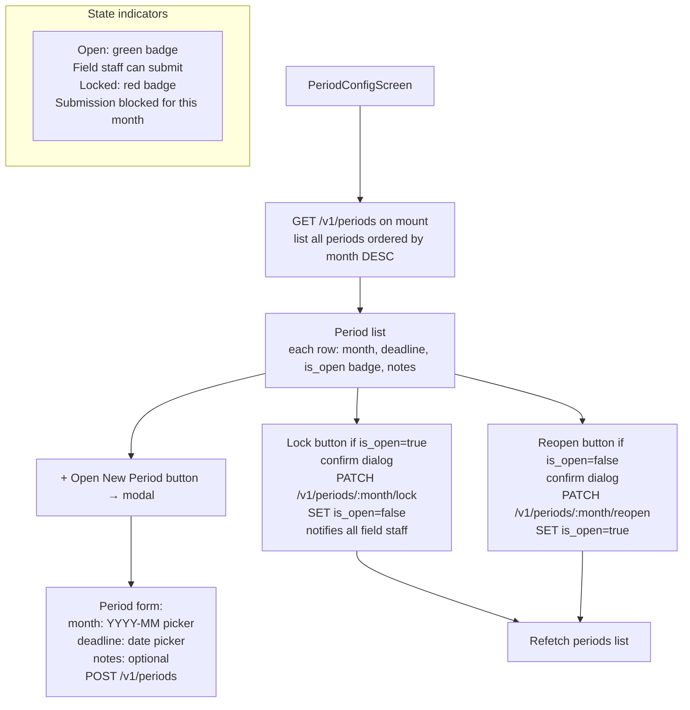

# File: ahpunjabfrontend/src/screens/PeriodConfigScreen.tsx

HQ Admin screen to manage reporting periods — open new months, set deadlines, lock or reopen.

**Notes:**
- Only one period per `month` value — the API returns 409 if the month already exists.
- Locking a period triggers push notifications + in-app notifications to all field staff whose reports are not yet submitted.
- Reopening is a recoverable action if a field staff member needs to amend after the initial lock.
- Deadline date is informational; the system does not automatically lock periods at deadline — an admin must manually lock.
