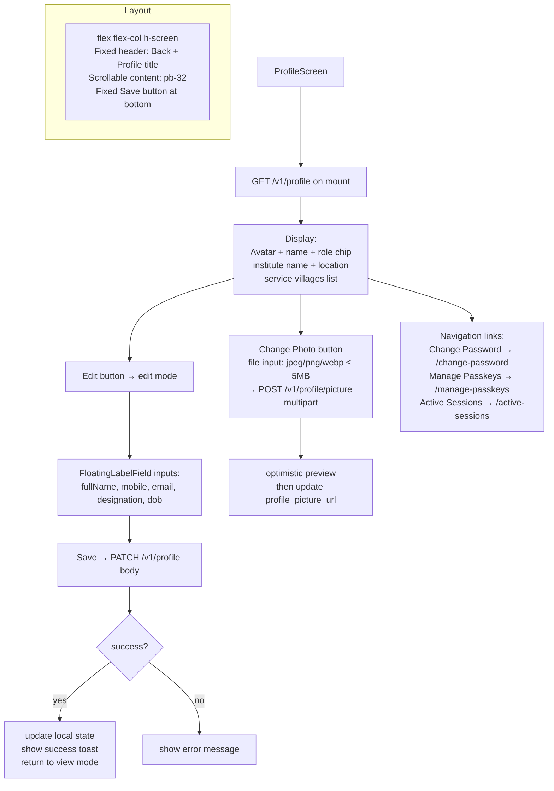

# File: ahpunjabfrontend/src/screens/ProfileScreen.tsx

Displays and edits the logged-in user's profile. Uses flexbox scroll pattern (not fixed positioning).

**Notes:**
- Profile picture shows initials avatar when `profile_picture_url` is null.
- Edit mode replaces display text with `FloatingLabelField` components.
- Service villages are displayed as a tag cloud below the institute info.
