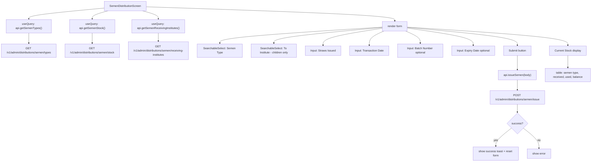

# File: PWA/src/screens/SemenDistributionScreen.tsx

SemenBank issue form — issue straws to a direct-child institute.

**Guard:** Backend route has `requireSemenIssuer` — only SemenBank role can hit POST /semen/issue. If another role somehow reaches this screen, the API returns 403.

**File:** `PWA/src/screens/SemenDistributionScreen.tsx`
