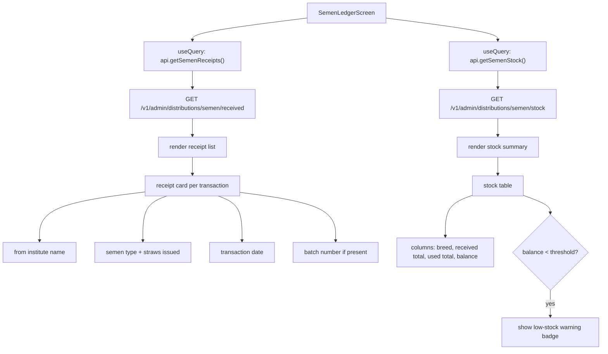

# File: PWA/src/screens/SemenLedgerScreen.tsx

Received semen history + current stock balance for any field role.

**Roles:** All FIELD_ROLES can view their receipts (`requireFieldRole`). SemenBank also sees issuance history as receipts in this view (incoming from HQ or district).

**File:** `PWA/src/screens/SemenLedgerScreen.tsx`
