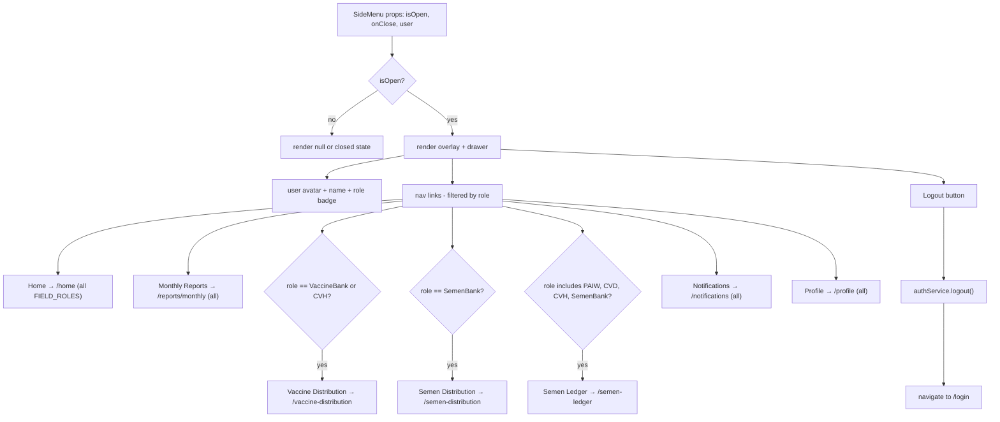

# File: PWA/src/components/SideMenu.tsx

Slide-out navigation — role-filtered links, async logout.

```mermaid
flowchart TD
    A[SideMenu props: isOpen, onClose, user] --> B{isOpen?}
    B -->|no| C[render null or closed state]
    B -->|yes| D[render overlay + drawer]

    D --> E[user avatar + name + role badge]
    D --> F[nav links - filtered by role]

    F --> G["Home → /home (all FIELD_ROLES)"]
    F --> H["Monthly Reports → /reports/monthly (all)"]
    F --> I{"role == VaccineBank or CVH?"}
    I -->|yes| J["Vaccine Distribution → /vaccine-distribution"]
    F --> K{"role == SemenBank?"}
    K -->|yes| L["Semen Distribution → /semen-distribution"]
    F --> M{"role includes PAIW, CVD, CVH, SemenBank?"}
    M -->|yes| N["Semen Ledger → /semen-ledger"]
    F --> O["Notifications → /notifications (all)"]
    F --> P["Profile → /profile (all)"]

    D --> Q[Logout button]
    Q --> R["authService.logout()"]
    R --> S["navigate to /login"]
```

**File:** `PWA/src/components/SideMenu.tsx`
